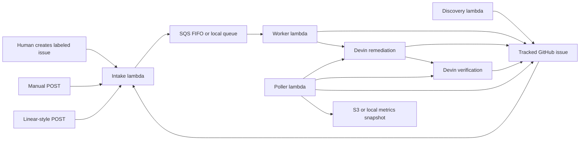

# Event-Driven Devin Remediation Architecture

## Purpose

This document explains the implemented architecture of `devin-vuln-automation` and the intended operating model behind it.

The concise story is:

`event-driven Devin remediation with AWS or local-runtime governance`

The system accepts engineering signals, normalizes and buffers them, then hands each bounded work item to Devin as the end-to-end remediation operator.

## System Boundary

This repo is the control plane. The application work surface is `C0smicCrush/superset-remediation`.

In scope:

- intake of GitHub, manual, and Linear-style events
- queueing, ordering, dedupe, and concurrency control
- Devin remediation and verification session launch
- GitHub issue and PR updates
- metrics snapshots and the local dashboard

Out of scope:

- building a first-party scanner platform
- replacing GitHub or Linear as a work-management product
- building a heavyweight analytics platform
- moving engineering decision-making out of Devin and into Lambda

## Responsibility Split

### Control plane responsibilities

The control plane is responsible for:

- receiving and shaping inbound events
- validating GitHub webhooks when a secret is configured
- buffering work through SQS FIFO or the local file-backed queue
- enforcing ordering and concurrency limits
- creating or linking the tracked GitHub issue
- launching Devin sessions with the right prompt and metadata
- polling session state
- publishing metrics and status

### Devin responsibilities

Devin is responsible for:

- interpreting the incoming issue or finding
- inspecting repository context
- deciding whether the work is actionable
- choosing the smallest safe remediation
- selecting validation steps
- making the change
- opening or updating the PR
- summarizing blockers, residual risk, and follow-up needs

The key architectural rule is:

`Lambda routes and governs. Devin investigates, decides, fixes, validates, and reports.`

## Runtime Modes

The same logic can run in two modes:

- local mode: file-backed queue and metrics, Docker Compose orchestration
- AWS mode: Lambda, SQS FIFO, S3 metrics snapshot, EventBridge scheduling, and Secrets Manager-backed configuration

Runtime selection is controlled by `aws_runtime.py`:

- `RUNTIME_BACKEND=local` forces local mode
- `AWS_APP_SECRET_NAME=<secret>` enables AWS-backed settings
- if neither is set, the runtime defaults to local mode

## Intake Model

The current implementation has one downstream remediation pipeline but multiple intake paths:

- `/github`
- `/manual`
- `/linear`

This is an important distinction. GitHub issues labeled `devin-remediate` are the main tracked artifact surface, but they are not the only ingress path.

### What actually happens

- GitHub issue and comment events arrive through `/github`
- manual demo/operator payloads arrive through `/manual`
- Linear-style payloads arrive through `/linear`
- discovery creates GitHub issues directly, and those issues then emit normal GitHub webhooks into `/github`

For manual and Linear inputs, the worker creates or links the tracked issue after the raw event has already entered the control plane.

## End-to-End Flow



The implemented lifecycle is:

1. An event reaches intake directly or through a GitHub webhook.
2. Intake parses the payload into a canonical raw event envelope.
3. Intake enqueues the event with a family-specific ordering key.
4. The worker dequeues the event.
5. The worker shapes the remediation work item in Python, creates or links the tracked issue if needed, and enforces concurrency limits.
6. The worker launches one broad Devin remediation session.
7. If Devin opens a PR, the poller launches a separate verification session for that PR.
8. The poller writes deduped status updates to GitHub and stores the latest metrics snapshot.

## Event Sources

### GitHub issue events

This is the cleanest hosted path.

Supported issue webhook actions today:

- `opened`
- `reopened`
- `labeled`

The `labeled` path only triggers when the added label is `devin-remediate`. `opened` and `reopened` only trigger when the issue already carries that label.

### GitHub comment follow-ups

Tracked issue comments and linked PR review comments are first-class follow-up events.

The intake layer:

- ignores automation-authored comments
- resolves linked PR comments back to the canonical issue
- dedupes by `comment_id`

The worker then launches another remediation pass for actionable follow-up.

### Manual events

The manual endpoint exists for replay, demos, and operator-driven testing.

It accepts direct JSON and does not require a pre-existing GitHub issue. If the payload does not already specify a canonical issue number, the worker creates the issue before launching Devin.

### Linear-style events

The current `/linear` path accepts direct JSON and maps it into the same raw event shape used elsewhere.

It is useful as an extensibility proof point, but it is not production-hardened yet. The current implementation does not verify a Linear signature.

### Discovery events

`lambda_discovery.py` is an issue producer, not a separate remediation lane.

It:

1. acquires a discovery lock
2. ensures there is no other active discovery session
3. launches a bounded discovery session
4. filters findings by confidence and automation decision
5. creates GitHub issues for accepted findings

Those GitHub issues then enter the normal `/github` intake path through their webhook events.

## Queueing And Ordering

The queue is FIFO in AWS and file-backed in local mode.

Important behaviors:

- ordering is per `family_key`, not global
- the worker launches one remediation session at a time per tracked issue family
- active-session checks prevent duplicate launches on the same issue
- the queue delay creates a small coalescing window

Current deployed defaults:

- FIFO delay: `30s`
- worker event source batch size: `1`
- worker maximum active remediations: controlled by `MAX_ACTIVE_REMEDIATIONS`

Trade-off:

- better local ordering and lower overlap risk
- slower time to first action under bursts

## Current Implementation Notes

The implemented worker flow is:

1. raw event arrives
2. `build_work_item_for_remediation()` seeds the work item in Python
3. `ensure_tracking_issue()` creates or links the canonical issue
4. the worker launches one broad remediation session

That means normalization is not happening inside Devin. It happens in the control plane before the session is launched.

The worker still stays intentionally thin: it shapes transport and policy context, but it does not attempt to replace Devin's repository reasoning.

## Verification Model

Verification is intentionally separate from remediation.

When the poller sees a new PR URL on a remediation session and there is not already a verification session for that PR, it launches a second Devin session with a stricter review posture.

That verification session is expected to:

- independently inspect the PR and repository state
- rerun the narrowest credible validation
- decide whether the issue is `verified`, `partially_fixed`, `not_fixed`, or `not_verified`

This prevents the system from treating the remediation session's self-report as the final source of truth.

## Policy And Validation

Policy lives in `config/test_tiers.json`.

Current tiers:

- `tier0_auto_dependency_patch`
- `tier1_auto_targeted_runtime`
- `tier2_manual_review`
- `tier3_manual_hold`

The worker uses these tiers as guidance for:

- automation decision
- validation breadth
- manual-review expectation

The policy is intentionally advisory rather than a deep workflow engine. Devin still owns the engineering plan.

The prompt and structured output schema require remediation receipts such as:

- `scanner_before`
- `scanner_after`
- `tests`
- `residual_risk`

## Observability

The system is designed to answer one reviewer question quickly:

`Is work flowing, and where are the artifacts?`

Current observability surfaces:

- GitHub issue comments
- GitHub PRs
- Devin session links
- CloudWatch logs in AWS
- S3 `reports/latest.json` in AWS
- local `metrics/latest.json`
- local dashboard at `http://localhost:8001`

The dashboard reads:

- the latest metrics snapshot
- local queue depth from the file-backed queue

Key metrics include:

- queue depth
- active, completed, blocked, and failed sessions
- PRs opened
- tracked items verified
- tracked items verified on first pass
- tracked items needing human follow-up
- tracked items with multiple remediation loops
- verification verdict counts

## Security And Secrets

Secrets are loaded from either:

- environment variables in local mode
- AWS Secrets Manager in hosted mode

Representative sensitive values:

- `GH_TOKEN`
- `DEVIN_API_KEY`
- `DEVIN_ORG_ID`
- `GITHUB_WEBHOOK_SECRET`
- `LINEAR_WEBHOOK_SECRET`

Current security caveats:

- GitHub signature verification only happens when `GITHUB_WEBHOOK_SECRET` is set
- if the GitHub secret is empty, unsigned GitHub payloads are accepted in local/demo mode
- `/manual` and `/linear` currently accept direct JSON and should be treated as demo/operator paths rather than hardened public endpoints

## Cost And Simplicity Constraints

The architecture is intentionally lightweight for a personal AWS account and a take-home setting.

Cost-aware choices include:

- Lambda Function URL instead of API Gateway
- SQS instead of a custom orchestration service
- S3 snapshots instead of a database-backed reporting layer
- capped concurrency
- a small dashboard instead of a full analytics stack

This repo is optimizing for:

- credible demoability
- clear ownership boundaries
- low operational cost
- observable behavior

It is not optimizing for enterprise scale.

## Current Validation State

From the codebase and test suite, the system clearly exercises:

- manual intake handling
- queue buffering
- worker-driven remediation launch
- separate verification sessions
- dashboard payload generation
- comment dedupe and follow-up routing

What should be stated carefully is live production evidence. This repo documents the implemented flow, but any claims about current live GitHub artifacts should be treated as environment-specific rather than as an invariant of the codebase.

## Gaps And Future Improvements

The main remaining gaps are:

1. fully automating scanner-derived event ingestion in AWS
2. hardening `/manual` and `/linear` if they become more than demo/operator paths
3. reducing noisy status updates further
4. strengthening schema versioning and idempotency over time
5. moving AWS deployment toward stronger credential hygiene such as OIDC

## Final Framing

The most accurate concise description of this repo is:

`a thin, observable control plane that accepts engineering signals, buffers and governs them, and then hands each scoped work item to Devin as the end-to-end remediation operator`
# Event-Driven Devin Remediation Architecture

## Purpose

This document is the detailed design reference for the `devin-vuln-automation` system.

It is meant to answer, precisely:

1. What the system does
2. Where events come from
3. What is owned by AWS versus Devin versus GitHub
4. What the exact boundaries of the pipeline are
5. What is implemented today versus what the target operating model should be

The `README.md` is the concise project explanation. This document is the design-grade source of truth for future architectural decisions.

## Executive Summary

This system is an event-driven remediation control plane for a fork of Apache Superset.

Its job is to take engineering signals, especially vulnerability-related signals, and turn them into auditable remediation work with observable outcomes.

The core thesis is:

`AWS should govern the workflow; Devin should perform the engineering work.`

That means the hosted control plane is intentionally thin:

- receive events
- validate them
- normalize them into a canonical envelope
- buffer and order them
- launch Devin sessions
- track Devin session state
- publish status and metrics

The engineering intelligence should sit with Devin:

- interpret the incoming issue or finding
- inspect the repository
- determine whether the issue is actionable
- scope the likely blast radius
- choose a validation strategy
- make the code change
- run the narrowest credible tests
- open or update a pull request
- summarize the outcome or stop for manual review

This distinction matters because the take-home prompt is explicitly evaluating whether Devin is being used as a core primitive rather than a helper.

## Primary Use Case

The primary use case for this project is:

`Event-driven vulnerability remediation for a Superset fork`

Repositories:

- target repository: `C0smicCrush/superset-remediation`
- control plane repository: `C0smicCrush/devin-vuln-automation`

The clearest concrete example validated during development was a DOMPurify dependency remediation path derived from `npm audit` output against Superset frontend dependencies.

## Architectural Thesis

The design is built around one principle:

`Devin must own the engineering loop.`

If the system does too much reasoning in Lambda, then the architecture becomes:

`AWS automation with a Devin step`

That is not the intended story.

The intended architecture is:

`event-driven Devin automation with AWS guardrails`

In this model:

- AWS is the control plane
- GitHub is the work record and artifact surface
- Devin is the autonomous engineering operator

The right mental model is not "Lambda decides and Devin executes." The right mental model is "Lambda routes and governs; Devin investigates, decides, fixes, validates, and reports."

## System Goals

### Goals

- Accept engineering events from multiple upstream sources
- Treat manually created GitHub issues and tickets as first-class event sources
- Convert those events into bounded remediation work
- Use Devin as the end-to-end remediation operator
- Produce artifacts a VP of Engineering and senior ICs can inspect
- Keep the runtime cheap, simple, and auditable
- Support observability without requiring a heavyweight platform

### Non-goals

- Building a first-party enterprise vulnerability scanner
- Building a full ticketing platform
- Building a general-purpose workflow engine for every engineering task
- Maximizing throughput at the expense of control and clarity
- Replacing purpose-built detection systems like Dependabot, CodeQL, or package-audit tools

## Scope Boundaries

### In scope

- Manually created GitHub issues in `superset-remediation`
- Human-created Linear tickets and equivalent tracked work items
- Manual API-triggered events for operator control, replay, and demos
- Deterministic scanner findings such as `npm audit`, `pip-audit`, Dependabot, or CodeQL alerts
- Scheduled or operator-triggered Devin discovery runs that emit structured findings
- Canonical event wrapping, queue buffering, ordering, rate limiting, and observability
- Testing and validation planning as first-class outputs of the remediation workflow
- Devin-led investigation, remediation, validation, and PR creation

### Out of scope

- Building a first-party vulnerability intelligence product
- Replacing existing detection systems end to end
- Building a full ticketing or work-management platform
- Building a general-purpose automation platform for all engineering workflows
- Deep autonomous refactors outside bounded remediation tasks
- Heavyweight analytics, warehousing, or dashboard infrastructure

The key boundary is this:

- supporting manual issues, scanner findings, and bounded Devin discovery as event sources is in scope
- owning vulnerability discovery as a standalone product category is out of scope

## What Counts As "The Pipeline"

The pipeline includes:

- event creation or intake
- canonical event wrapping
- queue buffering and local ordering
- policy attachment and rate limiting
- Devin session launch
- Devin-driven investigation, remediation, and validation
- issue and PR updates
- polling and metrics publication

The pipeline does not include:

- package registry vulnerability intelligence itself
- sophisticated static analysis engines
- long-term data warehousing
- broad enterprise workflow configuration

This boundary is important. The novelty is not the scanner. The novelty is the event-driven control plane around Devin.

## Event Origin Taxonomy

The cleanest way to reason about the system is to separate event origins into three classes.

### 1. Human-created events

These are work items created directly by people.

Examples:

- a GitHub issue is opened in `superset-remediation`
- a GitHub issue is labeled `devin-remediate`
- a Linear ticket is created or moved into a remediation queue
- an operator POSTs a payload to the manual intake endpoint

These are useful because they are explicit, auditable, and easy to demonstrate.

### 2. Tool-created events

These are findings produced by another deterministic system.

Examples:

- `npm audit` finding
- `pip-audit` finding
- Dependabot alert
- CodeQL alert
- OSV-based dependency alert
- scheduled scan result from a lightweight job

These are the most natural match for the vulnerability-remediation framing in the take-home prompt.

### 3. Devin-created findings

These are findings produced by Devin after being triggered to inspect the repository.

Examples:

- scheduled repo review
- manual "discovery mode" run
- targeted review of a recently changed part of the repo
- periodic dependency and config review with bounded scope

This is the correct answer to "can Devin find issues in and of itself?"

Yes, but only in response to an upstream trigger. Devin can be the finding generator, but it should not be modeled as a magical spontaneous source of work. A scheduler, webhook, manual invocation, or operator action still needs to start the discovery run.

## Event Sources and Triggers

There is exactly one ingress to the remediation pipeline: a GitHub issue labeled `devin-remediate`. Everything in this section is a **producer** of that event — not a separate pipeline. A human, a Linear bridge, a manual POST, a scheduled scanner, or a scheduled Devin discovery run all converge on the same `IssueCreated(devin-remediate)` event, which then flows through a single path: webhook → intake → SQS → worker → Devin remediation → PR.

This is deliberate. It gives the system:

- one ingress to harden, authenticate, rate-limit, and observe
- one dedup boundary (issue number + `finding:<id>` label)
- one append-only event log per work item (the issue and its comments)
- a pluggable producer surface: new sources (Trivy webhook, pip-audit cron, Sentry alert, etc.) slot in as additional arrows into the ingress without changing anything downstream

The sections below describe each producer and the role it plays, but none of them are architecturally privileged.

After a tracked issue or PR exists, the system also treats **new human comments on that issue or PR** as follow-up workflow inputs. These are not new root producers of tracked issues; they are serialized continuation events on an existing work item. They re-enter through intake and are handled by the same broad remediation session, which can result in one of four outcomes:

- ignored as non-actionable chatter
- paused for manual review
- paused pending a narrow human answer
- launched as a bounded remediation follow-up tied to the same issue family

## 1. GitHub issue events

Trigger examples:

- issue opened with `devin-remediate`
- issue reopened with `devin-remediate`
- issue labeled `devin-remediate`

Why this source exists:

- aligns directly with the assignment requirement to create issues in the fork
- gives reviewers a durable, visible unit of work
- makes the remediation story easy to follow

Current status:

- implemented as a primary path
- limited to `issues` webhook events that explicitly carry `devin-remediate`

Recommended role:

- P0 source for explicitly tracked remediation items

## 2. Linear ticket events

Trigger examples:

- ticket created in a security or bug queue
- ticket moved to a workflow state such as `ready-for-remediation`
- ticket labeled as dependency, security, or urgent

Why this source exists:

- proves the architecture is not GitHub-specific
- demonstrates compatibility with real engineering team workflows
- broadens the system beyond a single SCM-native trigger source

Current status:

- stubbed and represented in the payload model

Recommended role:

- P1 extensibility source

## 3. Manual API events

Trigger examples:

- operator POST to `/manual`
- replay of a known finding fixture
- demo run with deterministic input

Why this source exists:

- makes the system easy to demo
- makes the system easy to replay
- avoids waiting on an external SaaS system during live validation

Current status:

- implemented

Recommended role:

- operator and demo source

## 4. Scheduled scanner events

Trigger examples:

- EventBridge cron executes every 6 hours or daily
- lightweight scanner job runs `npm audit --json`
- scanner output is transformed into one or more findings
- findings are emitted into the same intake path

Why this source exists:

- creates real vulnerability events without manual issue authoring
- keeps detection deterministic
- lets Devin focus on triage, scoping, remediation, and validation

Current status:

- not yet fully automated in AWS
- partially validated using local `npm audit` output as the upstream signal

Recommended role:

- P0/P1 automated vulnerability signal source

## 5. Scheduled Devin discovery events

Trigger examples:

- EventBridge starts a discovery run each day
- operator requests a repo review of the last 24 hours of changes
- scheduled "bounded security review" is launched against specific surfaces

What happens:

- the scheduler creates a `scheduled_discovery` event
- the discovery Lambda launches Devin in discovery mode
- Devin inspects the repo and emits structured findings
- those findings are turned into GitHub issues or remediation events

Why this source exists:

- shows Devin doing more than patch application
- demonstrates proactive discovery capability
- fits the prompt's interest in using Devin as a primitive rather than a helper

Current status:

- deployed in AWS with EventBridge as a dumb cron on a daily cadence (`rate(1 day)`) plus on-demand manual invoke
- bounded by default to one discovery finding per run
- output is always a GitHub issue with `devin-remediate` — discovery does not have its own path into remediation; it re-enters through the same ingress any other producer uses

Recommended role:

- P2 advanced source that strengthens the story without pretending Devin is a deterministic scanner replacement

## Should Devin Find Issues By Itself?

Yes, with an important caveat.

Devin should not be positioned as a replacement for every existing scanner. That weakens the design because it creates immediate questions about determinism, repeatability, false positives, and coverage.

The stronger framing is:

`Devin can perform discovery-oriented repository reviews when triggered, and can emit structured findings that become tracked work items.`

That means:

- scanners remain valid upstream sources
- human-authored tickets remain valid upstream sources
- Devin discovery becomes another event producer in the same system

This is stronger than saying "Devin is our scanner" and more aligned with how the platform is likely intended to be used.

## System of Record and Hosting Model

### AWS

AWS is the control plane runtime.

Deployed or intended resources:

- Lambda Function URL for intake
- SQS FIFO queue
- SQS FIFO dead-letter queue
- worker Lambda
- poller Lambda
- discovery Lambda
- Secrets Manager
- S3 bucket for status snapshots
- EventBridge as a dumb cron for scheduled producers (daily discovery by default; cron-only, not an event bus)

AWS is responsible for transport, policy, and observability. It should not become the engineering decision-maker.

### GitHub

GitHub is the human-visible work surface.

GitHub is responsible for:

- issues as tracked work items
- pull requests as remediation artifacts
- comments and status updates for auditability
- the visible source repository state

### Devin

Devin is the engineering runtime.

Devin is responsible for:

- interpreting ambiguous work items
- planning the remediation approach
- inspecting repository context
- selecting a validation path
- making code changes
- opening or updating PRs
- reporting what happened in engineering terms

### Local machine

The local machine is used for:

- development
- AWS CLI deployment
- simulation
- test execution during iteration
- running the Dockerized local control plane and observability dashboard

It is not required for steady-state hosted operation once the system is deployed.

## Core Responsibility Split

This section is the most important architectural boundary in the whole system.

## What AWS should do

AWS should:

- authenticate inbound requests where needed
- validate signatures
- shape inbound events into a canonical envelope
- buffer work in SQS
- enforce ordering by related work family
- enforce concurrency and cost controls
- launch Devin sessions with the right prompt and metadata
- poll session state
- publish metrics and status snapshots
- push durable state back to GitHub

AWS should not:

- decide remediation scope in a complex way
- hardcode blast-radius reasoning
- choose test strategy through a deep rules engine
- become the main brain of the workflow

## What Devin should do

Devin should:

- read the incoming issue or finding
- inspect the relevant repository surfaces
- determine if the finding is actionable
- define the smallest safe remediation scope
- identify likely touched files and affected surfaces
- choose the narrowest credible tests
- implement the fix
- run validation
- open or update the PR
- summarize what changed and any residual risk
- stop for manual review when confidence is not high enough

Devin should not:

- own webhook signature validation
- own queue semantics
- own credential storage
- own concurrency policy

## End-to-End Lifecycle

There is one pipeline. Every work item flows through it identically, regardless of who produced the triggering issue:

1. A producer (human, Linear bridge, manual POST, scheduled scanner, or scheduled Devin discovery) creates a GitHub issue labeled `devin-remediate`.
2. The GitHub webhook fires and Intake Lambda wraps it in a canonical event envelope.
3. The envelope is buffered in SQS FIFO with a family-specific message group (30s delay for coalescing).
4. Worker Lambda consumes the message when eligible, after dedup checks against active Devin sessions on the same issue.
5. Worker Lambda launches one broad Devin remediation session for that work item.
6. Devin investigates the issue, scopes it, validates it, fixes it if appropriate, and opens a normal PR with `scanner_before` / `scanner_after` / `tests` receipts.
7. A second Devin verification session reviews the PR, independently tests whether the PR actually fixes the issue, and writes its verdict to the PR and linked issue.
8. Poller Lambda tracks remediation / verification sessions and writes deduped status back to GitHub and S3.
9. Metrics and logs show whether the system is progressing, blocked, needs human follow-up, or has converged.

This is the target operating model because it makes Devin the owner of the end-to-end engineering loop, and it means there is exactly one path to reason about.

### Where scheduled Devin discovery fits in

Discovery is not a separate pipeline. It is an **issue producer** — one of several — whose job is to use a bounded Devin session to decide what issues to file. Concretely:

1. EventBridge (a dumb cron, `rate(1 day)` by default, also manually invokable) triggers `lambda_discovery.py`.
2. Discovery Lambda acquires a short-lived S3 lease and checks for an already-active discovery session.
3. Discovery Lambda launches one bounded Devin discovery session.
4. High-confidence findings are turned into GitHub issues labeled `devin-remediate` (plus `finding:<id>` for dedup).
5. From that point forward, those issues flow through the main lifecycle above with no special casing. The pipeline does not know or care that the issue came from discovery instead of from a human.

The same shape applies to any future producer: a `pip-audit` cron, a Trivy webhook, a Sentry alert bridge, etc. Each would land an issue with `devin-remediate` and re-enter the same path. No downstream code has to change.

### Where human follow-up comments fit in

Once a work item is in flight, the issue thread and PR thread become the human-Devin interface. A remediation or verification session may ask for narrowly scoped human information. When a human replies on the tracked issue or PR:

1. GitHub emits an `issue_comment` or `pull_request_review_comment` webhook.
2. Intake validates the comment, ignores automation-authored chatter, dedupes by `comment_id`, and resolves the comment back to the canonical tracked issue.
3. The follow-up event is buffered with the same FIFO family key as the tracked issue.
4. Worker Lambda launches another Devin remediation session against the same canonical issue family.
5. That session decides whether the comment is actionable follow-up, ignorable chatter, a manual-review condition, or a narrow request for more human input.
6. If actionable, the same session continues directly into bounded remediation work.

This keeps the human/Devin conversation inside the same control plane rather than creating an ad hoc side channel.

## Current Implementation

The current implementation uses one Devin remediation session per tracked work item:

- raw event arrives
- worker creates or links a GitHub issue
- worker builds a lightweight canonical work item in Python
- worker launches one broad remediation-oriented Devin session
- that session decides whether to ignore the input, stop for manual review, ask a human question, or continue into implementation

Normalization still exists conceptually, but it is now part of the remediation session rather than a separate first-class orchestration phase.

## Canonical Event Envelope

Every event source should be converted into a common envelope before entering the queue.

Representative fields:

- `event_type`
- `event_phase`
- `source.type`
- `source.action`
- `source.id`
- `source.url`
- `repo.owner`
- `repo.name`
- `title`
- `body`
- `labels`
- `created_at`
- `family_key`
- `canonical_issue_number` if already known
- `priority`
- `origin_metadata`

The purpose of the envelope is not deep semantic understanding. The purpose is transport consistency.

The envelope should be rich enough to let the worker formulate a good Devin prompt without forcing the worker to become a reasoning engine.

## Event Family and Ordering Model

The queue uses SQS FIFO.

Current queue family:

- buffer queue: `devin-vuln-automation-buffer.fifo`
- dead-letter queue: `devin-vuln-automation-dlq.fifo`

### Why FIFO exists

The goal is not global total ordering across all work.

The goal is local ordering for related work so the system does not launch multiple overlapping remediation attempts against the same issue family at once.

### Family key

Each event gets a `family_key`.

Examples:

- a dependency family such as `dompurify`
- a GitHub issue number
- a scanner finding identifier
- a normalized work item group

The `family_key` becomes the FIFO message group ID.

### Delay window

The queue uses a delay window to create a short stickiness period.

Current test-oriented deployment:

- `30s`

Planned production-like setting:

- `300s`

Reasoning:

- related events arriving close together should be processed in local order
- small intentional delay is cheaper and simpler than a richer coordination system
- some latency is acceptable in exchange for lower conflict risk

### Trade-off

Benefits:

- simpler ordering model
- fewer overlapping remediation sessions
- easier reasoning about related findings

Costs:

- slower time to first action
- intentional backlog under burst
- possibility of queue backpressure

This is a design choice, not an accident.

## Detailed Workflows By Source

## Workflow A: GitHub issue to Devin remediation

1. A GitHub issue is opened, reopened, or labeled for remediation with `devin-remediate`.
2. GitHub sends the webhook to the intake endpoint.
3. Intake Lambda validates the signature and wraps the event.
4. The event is written to SQS FIFO using a family-specific group key.
5. Worker Lambda dequeues the event once eligible.
6. Worker launches Devin with the issue context, repository context, and policy envelope.
7. Devin investigates whether the issue is real, actionable, and sufficiently bounded.
8. Devin either:
   - remediates the issue and opens or updates a PR, or
   - stops and marks the issue for manual review.
9. Poller Lambda tracks the session and publishes updates.

### Workflow A1: Human comment follow-up on a tracked issue or PR

1. A human comments on a tracked issue or on a PR linked to a tracked issue.
2. GitHub sends an `issue_comment` or `pull_request_review_comment` webhook.
3. Intake validates the signature, ignores bot/control-plane comments, and dedupes the comment by `comment_id`.
4. Intake resolves the canonical issue number for the comment and emits a follow-up raw event.
5. The event enters SQS FIFO under the same issue family key.
6. Worker Lambda launches another broad Devin remediation session tagged with the originating `comment:<id>`.
7. That session decides whether the comment is:
   - non-actionable and should be ignored
   - a manual-review signal
   - a narrow request for more human input
   - actionable follow-up that justifies another remediation pass
8. If actionable, the same session continues directly into bounded remediation work.
9. Poller and verification continue to report only material state changes, so the human conversation remains visible without becoming noisy.

## Workflow B: Scheduled scanner finding to GitHub issue and remediation

1. EventBridge starts a scheduled scanner job.
2. The scanner runs a deterministic check such as `npm audit --json`.
3. The scanner output is transformed into one or more finding events.
4. Each finding event enters the standard intake and queue path.
5. Worker launches Devin against each actionable finding.
6. Devin determines whether the finding is real, identifies the minimal fix, validates it, and opens or updates a PR.
7. The system records status in GitHub and S3.

This is likely the strongest production-shaped path for vulnerability remediation because it combines deterministic detection with Devin-driven engineering execution.

## Workflow C: Scheduled Devin discovery run

Discovery is an issue producer, not a separate remediation workflow. Its only output is GitHub issues; everything after that reuses Workflow A.

1. EventBridge fires on a daily cadence (or an operator manually invokes `lambda_discovery`).
2. Discovery Lambda acquires a lightweight S3-backed lease and checks for any already-active discovery session.
3. If the lease is unavailable or a discovery session is already active, the run exits without launching Devin.
4. Otherwise, Discovery Lambda launches Devin in bounded discovery mode (`max_acu_limit: 1`).
5. Devin inspects the repository for actionable findings within a specified scope.
6. Devin returns structured findings plus `rejected_findings` with reasons.
7. High-confidence findings are filtered (confidence, automation decision, dedup against open issues) and turned into GitHub issues with `devin-remediate` and `finding:<id>` labels.
8. From step 7 onward the flow is literally Workflow A with no modifications.

This path is useful because it demonstrates proactive Devin usage, but it should be positioned as additive rather than as a replacement for deterministic scanners. Structurally it is interchangeable with any other issue producer.

## Workflow D: Manual demo run

1. An operator POSTs a fixture to `/manual`.
2. Intake wraps and queues the event.
3. Worker launches Devin.
4. Poller reports progress.
5. Result is visible in issue comments, PRs, logs, and metrics snapshots.

This path exists so the system is demoable on demand.

## Devin Session Contract

The best way to think about a Devin remediation session is as a bounded engineering mandate.

A strong session prompt should tell Devin to:

- investigate the input issue or finding
- determine whether it is actionable in this repository
- identify the smallest safe remediation
- define the exact validation scope
- make the fix if confidence is sufficient
- run the validation it selected
- open or update a PR with a summary
- stop and report if manual review is required

This is materially different from prompting Devin only to "apply a patch."

The session should feel more like assigning a scoped engineering task to a capable teammate.

## Testing and Scope Policy

The testing tier framework remains useful, but it should be treated as policy guidance for Devin rather than a rigid workflow engine inside Lambda.

Current tier definitions live in:

- `config/test_tiers.json`

Representative tiers:

- `tier0_auto_dependency_patch`
- `tier1_auto_targeted_runtime`
- `tier2_manual_review`
- `tier3_manual_hold`

### How the tiers should be used

The worker should tell Devin:

- what automation levels are permitted
- when manual review is required
- what validation breadth is expected for the class of change

The worker should not fully script the engineering plan.

That preserves policy guardrails without shrinking Devin into a glorified code editor.

### Validation receipts contract

For the vulnerability flow, the structured output schema for the remediation session (`session_output_schema` in `scripts/common.py`) is explicit about what "validated" means. Devin must return:

- `scanner_before`: the exact scanner command (`npm audit --json`, `pip-audit`, or equivalent), its exit code, and the advisory IDs it reported before the fix.
- `scanner_after`: the same command rerun after the fix, with its exit code and advisory IDs, so the targeted advisory is demonstrably gone.
- `tests`: a list of scoped test commands with exit code, pass/fail flag, and short summary.
- `fixed_advisories` / `deferred_advisories`: what this PR actually addresses versus what has been intentionally split off.
- `residual_risk`: plain-language notes on anything not validated.

Any command that could not be run is recorded with `ran: false` and a `not_run_reason`. Silent skips are not allowed; they must show up either as explicit receipts with `ran: false` or as a `blocked_reason` on the session. The remediation prompt reinforces this in natural language, and the PR description is expected to mirror the same receipts so a reviewer never has to rerun Devin's work to trust it.

### One advisory per PR

Both the discovery and remediation prompts bias toward one advisory or CVE per tracked issue and per PR. Aggregated findings are only acceptable when a single package bump closes multiple advisories with no other surface. When Devin must split work, the leftover advisories appear in `deferred_advisories` and should become their own issues on the next discovery pass. This keeps the diff small enough that the scanner receipts actually tell a coherent story.

### Rejected findings audit trail

The discovery schema (`discovery_output_schema`) requires a `rejected_findings` list where Devin records candidates it considered and discarded, each with a short reason. The discovery Lambda and the `make discover-devin` runner return that list in their output. This turns discovery from a one-way filter into an auditable pass: reviewers can see both what became a tracked issue and what Devin looked at and deliberately walked away from.

## GitHub Artifact Strategy

GitHub is the visible audit layer for the system.

Artifacts include:

- issues representing tracked work items
- comments linking to Devin session progress
- PRs containing remediation changes
- PR descriptions summarizing scope, validation, and residual risk

### Why GitHub matters architecturally

The take-home prompt asks for observable outputs for a technical audience.

GitHub issues and PRs are the most credible outputs because they map directly to how engineering leaders and reviewers reason about work.

## Component Responsibilities

## Intake Lambda

Primary file:

- `lambda_intake.py`

Responsibilities:

- receive external events
- validate signatures or basic auth conditions when applicable
- map payloads into the canonical event envelope
- enqueue work into SQS FIFO

Non-responsibilities:

- no remediation planning
- no deep severity reasoning
- no code changes
- no test selection

Desired characteristic:

- extremely small
- fast to execute
- almost entirely deterministic

## Worker Lambda

Primary file:

- `lambda_worker.py`

Responsibilities:

- consume queued events
- enforce concurrency and policy controls
- create GitHub issues when the event requires a tracked work item
- formulate the Devin session request
- launch Devin
- re-enqueue or defer when limits are hit

Non-responsibilities:

- should not own the engineering plan
- should not replace Devin's repository reasoning
- should not become a large rules engine

Current note:

- the worker now launches a broad Devin remediation session for every tracked work item, and that single session owns both triage and implementation decisions.

## Poller Lambda

Primary file:

- `lambda_poller.py`

Responsibilities:

- list active Devin sessions
- fetch current session state
- detect terminal versus non-terminal statuses
- publish comments back to GitHub
- write the latest metrics snapshot to S3

Non-responsibilities:

- does not plan work
- does not change remediation scope
- does not launch new remediation unless explicitly designed to do so

## Shared Runtime and Prompt Utilities

Primary files:

- `aws_runtime.py`
- `common.py`

Responsibilities:

- config loading
- Secrets Manager integration
- GitHub and Devin API helpers
- prompt construction
- canonical issue body construction
- work item shaping

These modules are part of the control plane glue. They should support Devin, not replace it.

## Observability Model

The system needs to answer one question for a technical audience:

`If I were an engineering leader, how would I know this is working?`

Current observability surfaces:

- GitHub issue comments
- GitHub pull requests
- Devin session links and status updates
- S3 snapshot such as `reports/latest.json`
- CloudWatch logs
- local Docker dashboard backed by `metrics/latest.json`

For the take-home deliverable, the Docker-local dashboard is important because it turns the metrics artifact into a human-readable analytics surface without requiring reviewers to inspect raw JSON or CloudWatch first.

The dashboard is intentionally simple:

- one lightweight service in Docker Compose
- reads the same local metrics artifact the poller writes
- displays queue depth, session counts, verification verdicts, issue rollups, and direct links out to GitHub and Devin

This is not meant to be a product analytics layer. It is a demo-grade observability surface that answers the core leadership question quickly: is the automation moving work forward, and where are the artifacts?

Useful metrics include:

- queued work items
- active Devin sessions
- completed sessions
- failed sessions
- manual-review outcomes
- PRs opened
- average time from event to session launch
- average time from launch to terminal state
- tracked items verified
- tracked items verified in first pass
- tracked items requiring human follow-up
- tracked items with multiple remediation loops
- accepted human comment follow-ups
- verification verdict counts by outcome

The system does not need a large analytics platform for the take-home. It needs enough observability to prove that work is flowing and to diagnose where it is stuck.

## Safety, Governance, and Manual Review

This system should not behave like an uncontrolled bot.

The guardrail model includes:

- source validation
- bounded queue concurrency
- family-level ordering
- policy tiers that limit automation scope
- explicit manual-review outcomes
- dead-letter queue for failed message handling
- tracked work in GitHub rather than hidden side effects

### Manual-review cases

Examples of when Devin should stop rather than continue:

- blast radius appears too broad
- validation surface is unclear
- the issue is not reproducible or not actionable
- the dependency upgrade causes major unrelated breakage
- the change would require architectural refactoring outside the task scope

This is important because the take-home is not just testing whether automation can act. It is also testing whether the system knows when not to act.

## Security and Secret Management

Secrets are stored in AWS Secrets Manager.

Representative sensitive values:

- `GH_TOKEN`
- `DEVIN_API_KEY`
- `DEVIN_ORG_ID`
- webhook secrets
- repo metadata
- concurrency and runtime settings

Lambda environment variables should be kept minimal and non-sensitive where possible.

## Cost and Simplicity Constraints

The architecture was intentionally shaped for a personal AWS account.

Cost-aware design choices include:

- Lambda Function URL instead of API Gateway
- small Lambdas
- SQS instead of a custom orchestration backend
- S3 for lightweight reporting instead of a database
- capped concurrency
- thin control plane instead of a large service mesh

This architecture is optimizing for:

- credible demoability
- low cost
- clarity of ownership
- minimal operational surface area

It is not optimizing for maximum enterprise scale.

## Current Validation State

The system has already exercised meaningful parts of the flow.

Validated behaviors include:

- manual intake event handling
- queue buffering
- worker-driven Devin session launch
- GitHub status updates
- real discovery-driven issue creation tied to a DOMPurify-related path
- real remediation output tied to that DOMPurify issue path

Current concrete artifacts include a live discovery-generated issue and a live remediation PR in `superset-remediation`, proving the end-to-end path in practice.

## Gaps Between Current State and Best Final Story

These are the most important gaps to keep in mind.

### 1. Scanner ingestion should become a first-class scheduled source

Right now scanner outputs are real but still partially manual in how they enter the pipeline.

### 2. The architecture should emphasize one broad Devin loop

The implementation now uses a single broad Devin task for tracked work items, including comment-driven follow-ups. The remaining work is mostly around proving the live end-to-end loop and keeping the GitHub status surface de-noised.

### 3. Scheduled Devin discovery is conceptually strong but not yet the primary validated path

It is now deployed and working, but it should still be presented honestly as a bounded low-volume extension path rather than as the main vulnerability signal source.

### 4. Polling and GitHub updates can be de-noised further

The system should avoid spammy status behavior while still making state visible.

## Recommended Final Framing For Reviewers

The strongest concise description of the system is:

`an AWS-hosted event-driven control plane that accepts engineering signals, buffers and governs them, and then hands each scoped work item to Devin as the end-to-end remediation operator`

Even more concretely:

- events can come from GitHub, Linear, manual intake, scanners, or scheduled Devin discovery
- AWS turns those into governed work items
- Devin investigates, fixes, validates, and reports
- GitHub and S3 expose the outcome

That is the right story for this take-home.

## Future Improvements

1. Add a scheduled AWS scanner path using `npm audit` or equivalent
2. Replace the lightweight S3 lease with a more formal lock if discovery concurrency or operational complexity grows
3. Add more durable idempotency keys for repeated findings
4. Add cleaner de-duplication for repeated GitHub status comments
5. Add explicit manual-approval workflow states for `tier2` and `tier3`
6. Add richer replay and fixture tooling for demo scenarios
7. Add stronger schema versioning for event envelopes and Devin outputs

## Operational Notes

### Redeploy AWS stack

```bash
cd "devin-vuln-automation"
make deploy-aws
```

### Test-speed queue delay

Current test-oriented delay:

- `30s`

### Production-like queue delay

```bash
QUEUE_DELAY_SECONDS=300 bash infra/deploy_aws.sh
```

### Run unit tests

```bash
make test
```

### Replay manual event

```bash
export INTAKE_URL="<lambda-url>"
make invoke-manual
```

### Replay Linear-style event

```bash
export INTAKE_URL="<lambda-url>"
make invoke-linear
```

## Final Position

This project should be understood as:

`event-driven Devin remediation with AWS governance`

Not:

- a custom scanner product
- a Lambda-heavy decision engine
- a generic automation platform

It is:

- a thin control plane
- a multi-source event intake system
- a queue-governed remediation workflow
- a Devin-first engineering loop
- an observable and defensible take-home implementation
