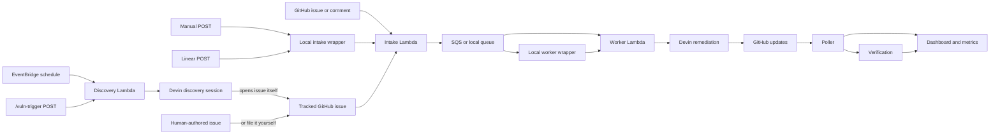
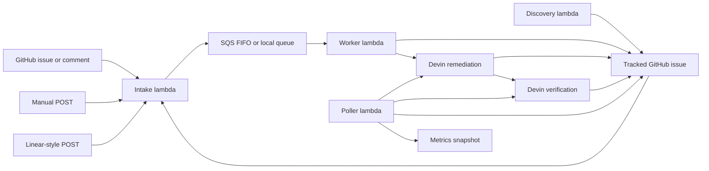

# Event-Driven Devin Remediation Architecture

## Overview

`devin-vuln-automation` is the control plane for governed, end-to-end vulnerability remediation against a target GitHub repository using Devin. Two halves: a **producer** side that tasks Devin with hunting code-grounded security vulnerabilities and filing each confirmed finding as a tracked issue, and a **remediation** side that takes any `devin-remediate`-labeled issue (from the hunt, a human, or a webhook) through Devin remediation → PR → independent Devin verification → status update.

Intended framing: `the control plane governs workflow, ordering, status, and safety; Devin hunts vulnerabilities and owns the engineering loop to fix them`. This repo is not the application work surface — by default the target is `C0smicCrush/superset-remediation`.

Discovery is posture-d as a security researcher reading source code, not as a wrapper around `npm audit` / `pip-audit`. Scanners may be consulted as background context, but every accepted finding must be grounded in a specific vulnerable call site (file, line, source → sink data flow). Raw dependency advisories with no reachable call site are rejected with an audit trail rather than filed as issues. See `config/prompts.yaml`.

**The vulnerability framing is an instantiation, not the architecture.** Most of what follows — the producer/remediator/verifier three-session split, the FIFO queue keyed on `family_key`, the silence-after-verdict poller, the agent-owned tracked issue convention — is domain-agnostic. See [Generalizing To Other Agent-Created Work](#generalizing-to-other-agent-created-work) for the explicit surface split.

## Event Flow

In plain English: work can start from GitHub, a manual/Linear POST, a scheduled discovery run, or an on-demand `/vuln-trigger`. The discovery lambda doesn't file issues itself — it hands the session to Devin, and **the Devin discovery session either opens the tracked GitHub issue itself or you file one directly**. From the tracked issue onward, every path flows through the same intake → queue → worker → remediation Devin → poller → verification loop, with GitHub as the artifact surface and the dashboard as the observability surface.

## Goals

- accept work from multiple ingress paths
- normalize and buffer work consistently
- let Devin perform remediation and verification as the main engineering primitive
- keep the orchestration layer cheap, thin, and observable
- provide a local Docker-first demo path and an AWS-hosted path

## Non-Goals

- building a first-party scanner platform
- replacing GitHub as the source of truth for artifacts
- replacing Devin with a large Lambda-side reasoning engine
- building a heavyweight data warehouse or analytics product

## System Context

Three surfaces: the control plane in this repo, the target GitHub repo where issues and PRs live, and Devin sessions that perform remediation and verification. AWS or the local runtime manages transport and state transitions; GitHub is the human-visible artifact surface; Devin is the engineering operator.

## Runtime Modes

Selected in `aws_runtime.py`: `RUNTIME_BACKEND` if set wins; otherwise `AWS_APP_SECRET_NAME` presence defaults to `aws`; otherwise `local`.

- **Local mode:** file-backed queue state in `LOCAL_STATE_DIR`, metrics in `LOCAL_METRICS_DIR/latest.json`, Docker Compose services for intake/worker/poller/dashboard.
- **AWS mode:** Lambda, SQS FIFO, S3 metrics snapshots, Secrets Manager, EventBridge scheduling, Lambda Function URL for intake.

## Responsibility Split

### Control plane responsibilities

The control plane is responsible for:

- accepting inbound events
- validating GitHub signatures when configured
- shaping canonical raw events
- queueing and ordering work
- deduping or requeueing when appropriate
- creating or linking the tracked GitHub issue
- launching Devin sessions
- polling for state changes
- publishing GitHub updates and metrics snapshots

### Devin responsibilities

Devin is responsible for:

- determining whether the work item is actionable
- inspecting repository context
- choosing the smallest safe remediation
- selecting validation scope
- making code changes
- opening or updating the PR
- summarizing blockers, risks, and outcomes

The boundary is deliberate:

`Lambda routes and governs. Devin investigates, decides, fixes, validates, and reports.`

## Ingress Model

There is one downstream remediation pipeline, but multiple ingress paths:

- `/github`
- `/manual`
- `/linear`
- `/vuln-trigger`

This is an important distinction. GitHub issues labeled `devin-remediate` are the primary tracked artifact surface, but not the only way work first enters the system. `/vuln-trigger` is a producer of those tracked issues; `/github`, `/manual`, and `/linear` consume them (or inject new ones directly).

### `/github`

The GitHub intake path supports:

- `issues` events for `opened`, `reopened`, and `labeled`
- `issue_comment`
- `pull_request_review_comment`

Current issue rules:

- `opened` and `reopened` only proceed if the issue already has `devin-remediate`
- `labeled` only proceeds if the added label is `devin-remediate`

Comment behavior:

- automation-authored comments are ignored
- linked PR comments are resolved back to the canonical tracked issue
- duplicate comment events are deduped by `comment_id`

### `/manual`

The manual path accepts direct JSON payloads and exists for demos, replay, and operator-triggered runs.

If the payload does not specify a canonical issue number, the worker creates the GitHub tracking issue before launching remediation.

### `/linear`

The Linear-style path accepts direct JSON payloads and maps them into the same canonical raw event shape.

It is currently useful as an extensibility proof point, not a production-hardened integration surface.

### `/vuln-trigger`

The vulnerability-trigger path is structurally different from the other three: it is a **producer** of tracked issues, not a consumer of external work.

A POST to `/vuln-trigger` short-circuits the intake lambda and invokes `lambda_discovery.handler` directly. No work item is enqueued at this step — discovery has its own concurrency guard (`acquire_discovery_lock` + `has_active_discovery_session`) and runs synchronously within the intake invocation. The handler result is returned as the HTTP response, so the caller sees findings counts, the issues Devin opened (`issues_opened_by_devin`), anything Devin recognized as a duplicate (`issues_skipped_as_duplicate`), any issue-creation failures Devin reported (`issue_creation_failures`), and the full `rejected_findings` audit trail inline. The control plane never files issues itself on this path — that is Devin's job, enforced by the `discovery` prompt.

The optional request body accepts a single field:

- `max_findings` (integer): caps how many accepted findings will be filed as issues on this run. If absent, the runtime default is used.

Everything else — target repo, Devin org, and the discovery prompt — comes from runtime settings, not from the request body. This is a deliberate narrowing: `/vuln-trigger` is a "go look" button, not a way for a caller to steer Devin toward a preconceived finding.

Findings that clear Devin's evidence bar and dedupe step become normal tracked issues on the target repo (opened by Devin itself inside the session) and then flow into the remediation pipeline through the usual path (via the `/github` webhook in hosted mode, or via the schedule/poller in local mode). From that point on, `/vuln-trigger`-sourced issues are indistinguishable from issues opened by a human.

The same producer runs on an EventBridge schedule in AWS via the standalone `lambda_discovery` function. `/vuln-trigger` is the on-demand version of that scheduled job.

## End-to-End Lifecycle

Implemented flow:

1. An event reaches intake directly or through a GitHub webhook.
2. Intake parses the payload and wraps it into a canonical raw event envelope.
3. Intake enqueues the event with a family-specific ordering key.
4. The worker dequeues the event.
5. The worker seeds the remediation work item in Python.
6. The worker creates or links the tracked GitHub issue if needed.
7. The worker applies concurrency and duplicate-session checks.
8. The worker launches one broad Devin remediation session.
9. If a PR appears, the poller launches a separate verification session.
10. The poller posts deduped status updates and stores the latest metrics snapshot.

## Queueing And Ordering

The queue is:

- SQS FIFO in AWS
- file-backed JSON queue state in local mode

Important behaviors:

- ordering is by `family_key`, not globally
- active remediation checks prevent overlapping sessions on the same tracked issue
- comment follow-ups requeue if a remediation session is already active
- queue delay creates a short coalescing window

Current deployment-oriented defaults:

- FIFO delay: `30s`
- worker event source batch size: `1`
- maximum active remediation count: `MAX_ACTIVE_REMEDIATIONS`

Trade-off:

- stronger local ordering and lower overlap risk
- slower time to first action under bursty input

## Worker Model

The worker is intentionally thin.

The implemented worker flow is:

1. raw event arrives
2. `build_work_item_for_remediation()` seeds and enriches the work item
3. `ensure_tracking_issue()` creates or links the canonical issue
4. duplicate-active-session checks run
5. concurrency checks run
6. `launch_remediation_session()` starts Devin

This means normalization and initial shaping happen in the control plane before Devin is launched. Devin does not receive completely raw transport payloads.

## Verification Model

Verification is separate from remediation.

The poller watches remediation sessions and, when it sees a new PR URL with no existing verification session for that PR, it launches a second Devin session with a stricter review posture.

Expected verification outcomes:

- `verified`
- `partially_fixed`
- `not_fixed`
- `not_verified`

This prevents the remediation session from being the sole source of truth about whether the fix actually worked.

### Silence after a terminal verdict

Once a verification session has landed any of the four terminal verdicts for a given `(issue, PR)` pair, the poller stops posting further status comments on that issue and PR. Concretely:

- the verdict-landing tick itself still narrates normally — the verification session's verdict comment is posted on both the issue and the PR, and the remediation session's final status comment is allowed through one last time
- every tick after that, the poller still fetches the sessions and still records metrics (for the dashboard), but it skips `_post_issue_comment` calls for the remediation session on that issue and for the verification session on that issue/PR

The purpose is to treat the verdict as the handoff signal back to humans. Status-detail and summary strings on a `verified` (or `not_fixed` / `partially_fixed` / `not_verified`) session can keep wiggling on Devin's side without generating comment noise on GitHub. A brand-new remediation session spawned later (e.g. a human comment kicks off a follow-up run that opens a different PR) gets a different `pr:` tag and therefore a fresh, unmuted loop. This behavior is local to the poller; Devin's own PR activity (e.g. `devin-ai-integration[bot]` replies inside the session) is not affected.

The implementation lives in `lambda_poller._build_terminal_verdict_index` (previously-landed verdicts only, so the landing tick still narrates) and the verification loop's `already_narrated_this_verdict` guard (silences re-posts of the same terminal verdict on subsequent ticks).

## Discovery Model

`lambda_discovery.py` is a producer, not a separate remediation lane. It is the single entry point used by both the EventBridge schedule (hosted) and the on-demand `/vuln-trigger` endpoint.

Its responsibilities are intentionally thin. Devin owns the engineering work — including filing the tracked issues — so the control plane is essentially orchestration + concurrency + reporting:

1. acquire a discovery lock
2. ensure there is no active discovery session already running
3. launch a bounded Devin session using the `discovery` prompt template
4. poll the session to terminal state and collect its structured output
5. surface what Devin reported — findings, `rejected_findings`, and the issues Devin opened on the target repo itself — as the response payload

Notably, the control plane does NOT filter findings by confidence, does NOT dedupe against open issues, and does NOT call the GitHub issues API. The `discovery` prompt pushes all of that work into the Devin session, because the control plane's filters were brittle (e.g. silently dropping a high-confidence XSS finding because Devin used the string `auto_open_remediation_pr` for `automation_decision` instead of one of a hardcoded allowlist). Devin is better positioned than the control plane to decide whether a finding is worth filing, and the prompt holds it to a specific evidence bar before that happens.

### Discovery posture

The `discovery` prompt frames Devin as a security researcher reading the application source, not as a post-processor of scanner output. The prompt:

- Enumerates the in-scope vulnerability classes (authz/authn gaps including IDOR, injection sinks, SSRF, path traversal, unsafe deserialization, XSS, CSRF, open redirects, overly permissive CORS, secrets in source, weak crypto, unsafe `eval`/`exec`, mass assignment, insecure auth/session defaults, etc.).
- Explicitly rules out code-style concerns, "this library is old" observations, theoretical issues without a reachable sink, and generic hardening suggestions that don't correspond to an exploitable flaw.
- Treats scanners (`npm audit`, `pip-audit`, `bandit`, `semgrep`, `gosec`) as optional background context. Scanner output alone is never sufficient to elevate something into `findings`; to accept a dependency-driven vulnerability, Devin must independently locate the vulnerable call site in the repository.
- Requires every accepted finding to include, in its `evidence` field: specific file paths and line numbers for both the source (untrusted input) and the sink (dangerous operation), a concrete data flow paragraph, a short exploitation sketch, and inline snippets of the vulnerable code.
- Requires `confidence` to be `high` (all three legs — source, sink, data flow — verified in actual code) or `medium` (one leg inferred); `low`-confidence findings must be rejected, not emitted.
- Requires `issue_labels` to include `security-remediation` and a vulnerability-class label (`vuln:authz`, `vuln:ssrf`, `vuln:xss`, `vuln:injection`, `vuln:deserialization`, `vuln:secrets`, `vuln:crypto`, `vuln:path-traversal`, `vuln:csrf`, `vuln:open-redirect`).

### Rejection audit trail

`rejected_findings` is first-class output, not an afterthought. The prompt enumerates the standard rejection reasons (`no_reachable_call_site`, `input_is_trusted`, `already_sanitized_upstream`, `defense_in_depth_only`, `speculative_no_evidence`, `lint_or_style_only`, `out_of_scope_for_this_repo`) so downstream reviewers can see what Devin considered and chose not to promote. Zero accepted findings is an acceptable outcome of a discovery run; speculative findings are not.

### Devin-owned issue creation

The prompt requires Devin to open the tracked GitHub issue itself on `$owner/$repo` before the session ends, using the same GitHub access it already has via its configured GitHub integration. The contract covers:

- Deduping against already-open issues (by `finding:<slug>` label and exact title).
- Provisioning the required labels if they don't exist: `security-remediation`, `devin-remediate`, `devin-discovered`, `finding:<slug>`, and a `vuln:<class>` label.
- Drafting the issue body with a fixed section layout (Problem Statement, Discovery Evidence, Likely Touched Files, Suggested Validation, Scope Tier, Discovery Notes) so the downstream remediation session gets a predictable shape.
- Filing the issue via `POST /repos/$owner/$repo/issues`.
- Reporting the outcome on the finding via three new fields: `issue_creation_status` (`opened` / `duplicate_skipped` / `failed`), `issue_url`, and `issue_number`. Failures carry a short human-readable reason in `issue_creation_error` rather than silently degrading.

The control plane reads those fields back through `summarize_issue_creation` in `scripts/run_devin_discovery.py`, which buckets findings by status and returns them as `issues_opened_by_devin`, `issues_skipped_as_duplicate`, `issue_creation_failures`, and `findings_missing_issue_status` in the response payload. Any finding that comes back without an `issue_creation_status` is treated as a bug in the run (the `findings_missing_issue_status` bucket), not as a soft success.

Accepted findings then enter the normal `/github` path through GitHub webhooks once Devin has opened them, exactly as if a human had labeled an issue `devin-remediate`.

## Policy And Validation

Policy lives in `config/test_tiers.json`.

Current tiers:

- `tier0_auto_dependency_patch`
- `tier1_auto_targeted_runtime`
- `tier2_manual_review`
- `tier3_manual_hold`

These tiers guide:

- automation decision
- validation breadth
- manual-review expectation

They are intentionally advisory. The worker passes policy context, but Devin still owns the engineering plan.

The remediation and verification prompts require structured outputs such as:

- `scanner_before`
- `scanner_after`
- `tests`
- `residual_risk`
- verification verdicts and summaries

## Observability Model

The system is designed to answer a simple question:

`Is work flowing, and where are the artifacts?`

Current observability surfaces:

- GitHub issue comments
- GitHub PRs
- Devin session links
- CloudWatch logs in AWS
- S3 `reports/latest.json` in AWS
- local `metrics/latest.json`
- local dashboard at `http://localhost:8001`

### Dashboard behavior

The dashboard is served by `scripts/dashboard_server.py`.

It always reads:

- queue depth from local queue state
- metrics snapshot fields from `metrics/latest.json`

When `GH_TOKEN` is configured and GitHub requests succeed, the dashboard builds live repository state:

- tracked issue totals
- issue-to-PR conversion
- PR status counts
- follow-up metrics
- iteration metrics
- daily activity windows

When `DEVIN_API_KEY` and `DEVIN_ORG_ID` are configured, it can also pull project-scoped Devin session information for additional analytics.

The dashboard API is:

- `GET /health`
- `GET /api/metrics`

## Local Development Model

Docker Compose runs four main services:

- `intake`
- `worker`
- `poller`
- `dashboard`

There is also a `test` profile service for unit tests.

Local wrappers:

- `scripts/local_intake_server.py`
- `scripts/local_worker.py`
- `scripts/local_poller.py`

These call the same underlying Lambda handlers so local and hosted behavior stay closely aligned.

## Deployment Model

The deploy path in `infra/deploy_aws.sh` provisions or updates:

- SQS FIFO queue and DLQ
- metrics bucket
- Secrets Manager runtime secret
- Lambda functions
- worker event source mapping
- intake Function URL
- EventBridge schedules

Terraform assets also exist in `terraform/` for infrastructure management and migration workflows.

## Security Notes

Current security caveats are important:

- GitHub signature verification only happens when `GITHUB_WEBHOOK_SECRET` is set
- if the GitHub secret is empty, unsigned GitHub payloads are accepted
- `/manual` and `/linear` are operator/demo paths and should not be described as hardened public ingress surfaces
- the current `/linear` implementation does not verify a Linear signature

## Cost And Simplicity

This project is optimized for:

- a credible take-home implementation
- low AWS cost
- clear ownership boundaries
- observable system state

Deliberate choices include:

- Lambda Function URL instead of API Gateway
- SQS instead of a larger orchestration system
- S3 snapshots instead of a database-backed analytics layer
- capped concurrency
- a lightweight dashboard rather than a full analytics product

## Known Gaps

The main remaining gaps are:

1. full scanner-derived event automation in AWS
2. stronger hardening for `/manual` and `/linear`
3. further de-noising of GitHub status comments
4. stronger idempotency and schema-versioning over time
5. improved AWS credential hygiene in CI and deployment workflows

## Generalizing To Other Agent-Created Work

Vulnerability remediation is the shipped instantiation, not the architecture. The same scaffolding runs any bounded engineering task where you want a producer agent, a remediator agent, and an independent verifier — e.g. performance-regression triage, flaky-test remediation, dead-code pruning, dependency hygiene, schema-migration audits, or dataset-quality reviews. The split below is explicit so retargeting is a well-scoped edit, not a rewrite.

### Domain-agnostic primitives (keep unchanged)

- **Three-session role split** (producer → remediator → verifier, each its own Devin session with its own prompt and structured-output schema). The verifier running independently is what prevents the remediator from being the sole source of truth; that property is not vuln-specific.
- **Agent-owned tracked artifacts.** Devin opens the tracked GitHub issue itself: dedupe by label + title, label provisioning, issue body layout, and outcome reporting via `issue_creation_status` (`opened` / `duplicate_skipped` / `failed`). The control plane never touches the GitHub issues API on the producer path. Any producer domain can adopt this verbatim.
- **FIFO queueing by `family_key`.** Ordering is per logical work item, not global. The key shape (`finding-<slug>`) is what varies; the ordering guarantee is what matters. `perf-<route>`, `flake-<test-id>`, `refactor-<module>` all drop in.
- **Separate-session verification with four terminal verdicts** (`verified`, `partially_fixed`, `not_fixed`, `not_verified`) and silence-after-verdict in the poller (`_build_terminal_verdict_index` + `already_narrated_this_verdict`). "Did the claimed thing actually happen" is the generic question being answered.
- **Rejection audit trail.** `rejected_findings` is first-class output with enumerated reasons; zero accepted findings is a valid outcome and speculative ones are not. This is the invariant that prevents producer-agent blowup in any domain.
- **Runtime, queue, worker, poller, dashboard.** `aws_runtime.py`, the Lambda handlers, the FIFO queue, the metrics snapshot, and the dashboard are domain-blind. They move typed work items between states and surface rollups.

### Domain-specific surface (replace to retarget)

- **`config/prompts.yaml::discovery`** — the whole prompt. In-scope class taxonomy, evidence bar, required `confidence` leg semantics, rejection-reason enumeration, and the security-researcher posture. Remediation and verification prompts in the same file are already generic enough to need only wording tweaks.
- **Label and slug vocabulary** — `vuln:<class>`, `finding:<slug>`, `security-remediation`, `devin-discovered`. Replace with whatever the domain needs (e.g. `perf:<class>`, `regression:<slug>`, `performance`), enforced in the discovery prompt since Devin provisions the labels.
- **Structured-output schema** (`scripts/common.py::discovery_output_schema`). The envelope (findings array, evidence object, confidence enum, issue-creation fields) is generic; the per-finding payload shape is domain-specific (source/sink pair for vulns, before/after metric for perf regressions, flake-rate + repro for flaky tests, etc.).
- **Scope tiers in `config/test_tiers.json`** — tier names are advisory and passed to Devin as policy context, not gated on. `tier0_auto_dependency_patch` → `tier0_auto_trivial` is the shape of the edit.
- **Verification check-list inside the verifier prompt.** Substitute the domain's "did the claimed thing happen" rubric — e.g. "did the benchmark actually regress to baseline," "does the test pass 1000 iterations," "does the removed code have zero remaining references."

### What does NOT generalize (and shouldn't be forced to)

The security-researcher posture language in the discovery prompt, the `npm audit` / `pip-audit` background-context paragraph, and the source → sink evidence model are load-bearing for the vuln instantiation and would be actively misleading if copy-pasted into, say, a performance-hunting prompt. Replace wholesale, not by find-and-replace. Similarly, the `vuln:*` label taxonomy in the dashboard tiles is instantiation-specific and should be edited alongside any retargeting.

The concise description then: `a thin, observable control plane that accepts engineering signals, buffers and governs them, and hands each scoped work item to Devin as the end-to-end operator — shipped with a vulnerability instantiation, engineered to retarget.`
