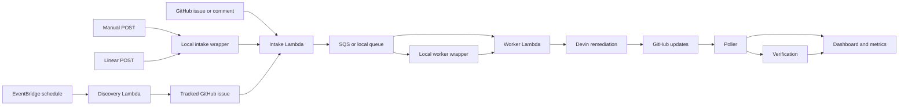
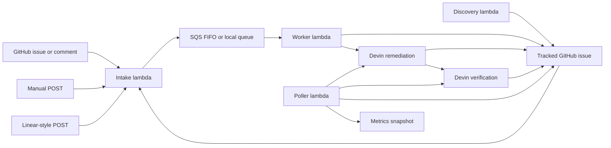

# Event-Driven Devin Remediation Architecture

## Overview

`devin-vuln-automation` is the control plane for turning engineering signals into governed Devin remediation work against a target GitHub repository.

The intended framing is:

`the control plane governs workflow, ordering, status, and safety; Devin owns the engineering loop`

This repo is not the application work surface. By default, the target repo is `C0smicCrush/superset-remediation`.

## Event Flow

In plain English: work can start from GitHub, a manual or Linear-style POST, or a scheduled discovery run. Everything ends up in the same intake and queue, the worker hands it to Devin, GitHub gets updated, and the poller plus dashboard show what happened.

## Goals

- accept work from multiple ingress paths
- normalize and buffer work consistently
- let Devin perform remediation and verification as the main engineering primitive
- keep the orchestration layer cheap, thin, and observable
- provide a local Docker-first demo path and an AWS-hosted path

## Non-Goals

- building a first-party scanner platform
- replacing GitHub as the source of truth for artifacts
- replacing Devin with a large Lambda-side reasoning engine
- building a heavyweight data warehouse or analytics product

## System Context

The system has three main surfaces:

- the control plane in this repo
- the target GitHub repository where issues and PRs live
- Devin sessions that perform remediation and verification

AWS or the local runtime manages transport and state transitions. GitHub is the human-visible artifact surface. Devin is the engineering operator.

## Runtime Modes

Runtime mode is selected in `aws_runtime.py`.

The logic is:

- if `RUNTIME_BACKEND` is set, that value wins
- otherwise, if `AWS_APP_SECRET_NAME` is set, backend defaults to `aws`
- otherwise, backend defaults to `local`

### Local mode

Local mode uses:

- file-backed queue state in `LOCAL_STATE_DIR`
- local metrics in `LOCAL_METRICS_DIR/latest.json`
- Docker Compose services for intake, worker, poller, and dashboard

### AWS mode

AWS mode uses:

- Lambda
- SQS FIFO
- S3 metrics snapshots
- Secrets Manager
- EventBridge scheduling
- Lambda Function URL for intake

## Responsibility Split

### Control plane responsibilities

The control plane is responsible for:

- accepting inbound events
- validating GitHub signatures when configured
- shaping canonical raw events
- queueing and ordering work
- deduping or requeueing when appropriate
- creating or linking the tracked GitHub issue
- launching Devin sessions
- polling for state changes
- publishing GitHub updates and metrics snapshots

### Devin responsibilities

Devin is responsible for:

- determining whether the work item is actionable
- inspecting repository context
- choosing the smallest safe remediation
- selecting validation scope
- making code changes
- opening or updating the PR
- summarizing blockers, risks, and outcomes

The boundary is deliberate:

`Lambda routes and governs. Devin investigates, decides, fixes, validates, and reports.`

## Ingress Model

There is one downstream remediation pipeline, but multiple ingress paths:

- `/github`
- `/manual`
- `/linear`

This is an important distinction. GitHub issues labeled `devin-remediate` are the primary tracked artifact surface, but not the only way work first enters the system.

### `/github`

The GitHub intake path supports:

- `issues` events for `opened`, `reopened`, and `labeled`
- `issue_comment`
- `pull_request_review_comment`

Current issue rules:

- `opened` and `reopened` only proceed if the issue already has `devin-remediate`
- `labeled` only proceeds if the added label is `devin-remediate`

Comment behavior:

- automation-authored comments are ignored
- linked PR comments are resolved back to the canonical tracked issue
- duplicate comment events are deduped by `comment_id`

### `/manual`

The manual path accepts direct JSON payloads and exists for demos, replay, and operator-triggered runs.

If the payload does not specify a canonical issue number, the worker creates the GitHub tracking issue before launching remediation.

### `/linear`

The Linear-style path accepts direct JSON payloads and maps them into the same canonical raw event shape.

It is currently useful as an extensibility proof point, not a production-hardened integration surface.

## End-to-End Lifecycle

Implemented flow:

1. An event reaches intake directly or through a GitHub webhook.
2. Intake parses the payload and wraps it into a canonical raw event envelope.
3. Intake enqueues the event with a family-specific ordering key.
4. The worker dequeues the event.
5. The worker seeds the remediation work item in Python.
6. The worker creates or links the tracked GitHub issue if needed.
7. The worker applies concurrency and duplicate-session checks.
8. The worker launches one broad Devin remediation session.
9. If a PR appears, the poller launches a separate verification session.
10. The poller posts deduped status updates and stores the latest metrics snapshot.

## Queueing And Ordering

The queue is:

- SQS FIFO in AWS
- file-backed JSON queue state in local mode

Important behaviors:

- ordering is by `family_key`, not globally
- active remediation checks prevent overlapping sessions on the same tracked issue
- comment follow-ups requeue if a remediation session is already active
- queue delay creates a short coalescing window

Current deployment-oriented defaults:

- FIFO delay: `30s`
- worker event source batch size: `1`
- maximum active remediation count: `MAX_ACTIVE_REMEDIATIONS`

Trade-off:

- stronger local ordering and lower overlap risk
- slower time to first action under bursty input

## Worker Model

The worker is intentionally thin.

The implemented worker flow is:

1. raw event arrives
2. `build_work_item_for_remediation()` seeds and enriches the work item
3. `ensure_tracking_issue()` creates or links the canonical issue
4. duplicate-active-session checks run
5. concurrency checks run
6. `launch_remediation_session()` starts Devin

This means normalization and initial shaping happen in the control plane before Devin is launched. Devin does not receive completely raw transport payloads.

## Verification Model

Verification is separate from remediation.

The poller watches remediation sessions and, when it sees a new PR URL with no existing verification session for that PR, it launches a second Devin session with a stricter review posture.

Expected verification outcomes:

- `verified`
- `partially_fixed`
- `not_fixed`
- `not_verified`

This prevents the remediation session from being the sole source of truth about whether the fix actually worked.

## Discovery Model

`lambda_discovery.py` is a producer, not a separate remediation lane.

Its responsibilities are:

1. acquire a discovery lock
2. ensure there is no active discovery session already running
3. launch bounded Devin discovery
4. filter findings by confidence and automation decision
5. create tracked GitHub issues for accepted findings

Those issues then enter the normal `/github` path through GitHub webhooks.

## Policy And Validation

Policy lives in `config/test_tiers.json`.

Current tiers:

- `tier0_auto_dependency_patch`
- `tier1_auto_targeted_runtime`
- `tier2_manual_review`
- `tier3_manual_hold`

These tiers guide:

- automation decision
- validation breadth
- manual-review expectation

They are intentionally advisory. The worker passes policy context, but Devin still owns the engineering plan.

The remediation and verification prompts require structured outputs such as:

- `scanner_before`
- `scanner_after`
- `tests`
- `residual_risk`
- verification verdicts and summaries

## Observability Model

The system is designed to answer a simple question:

`Is work flowing, and where are the artifacts?`

Current observability surfaces:

- GitHub issue comments
- GitHub PRs
- Devin session links
- CloudWatch logs in AWS
- S3 `reports/latest.json` in AWS
- local `metrics/latest.json`
- local dashboard at `http://localhost:8001`

### Dashboard behavior

The dashboard is served by `scripts/dashboard_server.py`.

It always reads:

- queue depth from local queue state
- metrics snapshot fields from `metrics/latest.json`

When `GH_TOKEN` is configured and GitHub requests succeed, the dashboard builds live repository state:

- tracked issue totals
- issue-to-PR conversion
- PR status counts
- follow-up metrics
- iteration metrics
- daily activity windows

When `DEVIN_API_KEY` and `DEVIN_ORG_ID` are configured, it can also pull project-scoped Devin session information for additional analytics.

The dashboard API is:

- `GET /health`
- `GET /api/metrics`

## Local Development Model

Docker Compose runs four main services:

- `intake`
- `worker`
- `poller`
- `dashboard`

There is also a `test` profile service for unit tests.

Local wrappers:

- `scripts/local_intake_server.py`
- `scripts/local_worker.py`
- `scripts/local_poller.py`

These call the same underlying Lambda handlers so local and hosted behavior stay closely aligned.

## Deployment Model

The deploy path in `infra/deploy_aws.sh` provisions or updates:

- SQS FIFO queue and DLQ
- metrics bucket
- Secrets Manager runtime secret
- Lambda functions
- worker event source mapping
- intake Function URL
- EventBridge schedules

Terraform assets also exist in `terraform/` for infrastructure management and migration workflows.

## Security Notes

Current security caveats are important:

- GitHub signature verification only happens when `GITHUB_WEBHOOK_SECRET` is set
- if the GitHub secret is empty, unsigned GitHub payloads are accepted
- `/manual` and `/linear` are operator/demo paths and should not be described as hardened public ingress surfaces
- the current `/linear` implementation does not verify a Linear signature

## Cost And Simplicity

This project is optimized for:

- a credible take-home implementation
- low AWS cost
- clear ownership boundaries
- observable system state

Deliberate choices include:

- Lambda Function URL instead of API Gateway
- SQS instead of a larger orchestration system
- S3 snapshots instead of a database-backed analytics layer
- capped concurrency
- a lightweight dashboard rather than a full analytics product

## Known Gaps

The main remaining gaps are:

1. full scanner-derived event automation in AWS
2. stronger hardening for `/manual` and `/linear`
3. further de-noising of GitHub status comments
4. stronger idempotency and schema-versioning over time
5. improved AWS credential hygiene in CI and deployment workflows

## Final Framing

The best concise description of this repo is:

`a thin, observable control plane that accepts engineering signals, buffers and governs them, and then hands each scoped work item to Devin as the end-to-end remediation operator`
