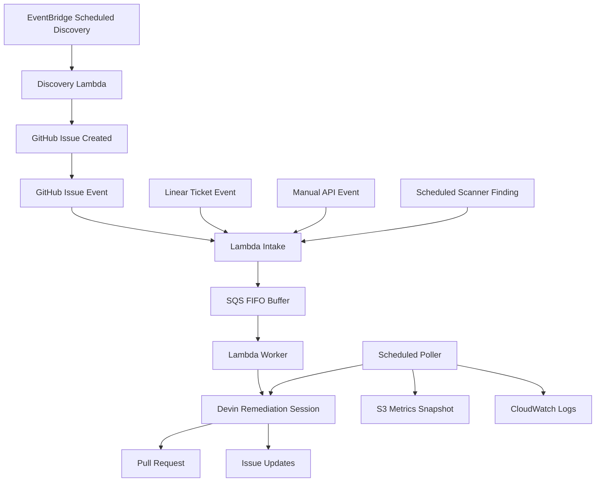

# Event-Driven Devin Remediation on AWS

## TL;DR

This project is an AWS-hosted event-driven remediation control plane for a fork of Apache Superset.

The key design choice is simple:

`AWS governs the workflow. Devin performs the engineering work.`

In practice that means:

1. An engineering event is created by a human, a deterministic tool, or a scheduled discovery run.
2. AWS intake receives the event, validates it, wraps it in a canonical envelope, and buffers it in SQS FIFO.
3. The worker launches Devin as the end-to-end remediation operator for that work item.
4. Devin investigates the issue, scopes the blast radius, chooses validation, makes the fix if appropriate, and opens or updates a PR.
5. A poller tracks status and publishes observable outputs to GitHub, S3, and CloudWatch.

The system is intentionally multi-source. Events can come from:

- GitHub issues explicitly labeled `devin-remediate`
- Linear tickets
- manual API requests
- scheduled scanner findings such as `npm audit`
- scheduled Devin discovery runs

This project does not try to replace scanners. Existing tools produce findings; this system turns those findings into governed remediation work and uses Devin to execute the engineering loop.

## Repositories

- Target application repo: `C0smicCrush/superset-remediation`
- Automation repo: `C0smicCrush/devin-vuln-automation`

`superset-remediation` is the work surface where issues and remediation PRs live.

`devin-vuln-automation` is the control plane. It contains the Lambda handlers, SQS integration, deployment scripts, prompt helpers, scope/test policy, and simulation tooling.

## What This System Does

This project solves a specific workflow problem:

`when a remediation-worthy engineering signal appears, route it through a low-cost event system and let Devin handle the actual engineering task with observable outcomes`

The signal can be a vulnerability finding, a ticket, or a tracked issue. The system does not assume all work starts as a GitHub issue, but it does use GitHub as the most important human-visible artifact surface.

## Why Devin Is The Primitive

The take-home prompt explicitly asks for Devin to be used as a core primitive, not as a helper.

So the system is designed such that AWS does not become the reasoning engine.

AWS is responsible for:

- receiving and validating events
- canonicalizing payloads
- queueing and ordering work
- enforcing rate limits and safety controls
- launching Devin sessions
- polling session state
- publishing metrics and status

Devin is responsible for:

- interpreting the incoming issue or finding
- inspecting repository context
- deciding whether the work item is actionable
- identifying the smallest safe remediation
- choosing the right validation scope
- making code changes
- running validation
- opening or updating a PR
- summarizing blockers, residual risk, or manual-review needs

That split keeps the control plane thin and makes Devin the owner of the engineering loop.

## Event Sources

The architecture supports five event-source classes.

### 1. GitHub issue events

Examples:

- issue opened with `devin-remediate`
- issue reopened with `devin-remediate`
- issue labeled `devin-remediate`

This is the cleanest P0 source because it aligns directly with the assignment and gives reviewers visible work items inside the fork.

Important detail:

- the deployed intake only accepts `issues` webhook events that explicitly carry `devin-remediate`

### 2. Linear ticket events

Examples:

- ticket created in a remediation queue
- ticket moved to `ready-for-remediation`
- ticket labeled security or dependency-related

This path proves the system is not GitHub-specific.

### 3. Manual API events

Examples:

- manual POST to `/manual`
- replay of a fixture for demos
- operator-triggered remediation run

This path exists for deterministic demos and easy replay.

### 4. Scheduled scanner events

Examples:

- EventBridge schedule triggers a lightweight scan
- `npm audit --json` or similar produces findings
- findings are emitted into the standard intake path

This is the strongest deterministic vulnerability source because it keeps detection simple and lets Devin focus on investigation, remediation, and validation.

### 5. Scheduled Devin discovery events

Examples:

- daily repo review
- bounded dependency review
- targeted review of recently changed code paths

This is how Devin can "find issues itself." A scheduler or operator triggers a discovery run, Devin emits structured findings, and those findings become issues or remediation events.

The hosted stack now includes an EventBridge-driven discovery schedule:

- EventBridge rule: every `2 hours`
- target: `devin-vuln-automation-discovery`
- default input: `{"event_type":"scheduled_discovery","max_findings":1}`

### Bounded discovery driver

There is also a bounded discovery driver for low-volume end-to-end runs:

```bash
make discover-devin
```

By default it is intentionally conservative:

- launches at most one discovery session at a time
- asks Devin for at most one actionable finding by default
- only creates issues for medium/high-confidence findings
- dedupes against existing open issues before creating a new one
- creates labeled GitHub issues that then enter the normal AWS webhook -> SQS -> worker path

## Architecture



## End-To-End Flow

1. An event is created by a human, tool, scheduler, or Devin discovery run.
2. Intake Lambda receives the event and wraps it in a canonical event envelope.
3. The event is written to SQS FIFO using a family-specific ordering key.
4. Worker Lambda consumes the message once it is eligible.
5. The worker applies guardrails such as concurrency limits and manual-review policy.
6. The worker launches one broad Devin session for the work item.
7. Devin investigates the issue, chooses the remediation strategy, validates its work, and opens or updates a PR if appropriate.
8. Poller Lambda tracks the session and writes status back to GitHub and S3.

For `linear_ticket` inputs and explicit discovery-mode events, the worker can still route through a lightweight preflight scoping step first. For GitHub issues, manual remediation payloads, and scanner-shaped findings, the default path is now one broad Devin remediation session.

For scheduled Devin discovery, the flow is slightly different:

1. EventBridge invokes `devin-vuln-automation-discovery`.
2. Discovery Lambda acquires the discovery lease and checks for an already-active discovery session.
3. Discovery Lambda launches one bounded Devin discovery session.
4. If Devin returns a high-confidence finding, Discovery Lambda creates a labeled GitHub issue.
5. That issue then enters the normal GitHub webhook -> intake -> SQS -> worker remediation path.

## Canonical Event Model

All event sources are wrapped into a common envelope before they hit the worker.

Representative fields include:

- `event_type`
- `event_phase`
- `source.type`
- `source.action`
- `source.id`
- `source.url`
- `repo.owner`
- `repo.name`
- `title`
- `body`
- `labels`
- `created_at`
- `family_key`
- `canonical_issue_number`
- `origin_metadata`

The envelope is meant to standardize transport, not to replace Devin's reasoning.

## Queueing Model

The queue is intentionally not just a pass-through.

- AWS service: SQS FIFO
- Buffer queue: `devin-vuln-automation-buffer.fifo`
- DLQ: `devin-vuln-automation-dlq.fifo`
- Default live test delay: `30s`
- Production-style delay: `300s`
- Ordering scope: per `family_key`, not global
- Worker batch size: `1`

### Why the buffered hold exists

The delay creates a small stickiness window so related events can remain locally ordered. This matters most for dependency families, repeated issue updates, or semantically related findings.

### Queue backpressure trade-off

The FIFO delay improves local ordering and reduces overlapping remediation attempts, but it also increases latency and can create backlog during bursts. That trade-off is intentional.

## Testing and Scope Policy

The system keeps explicit scope and validation policy so the automation remains interpretable.

Policy lives in:

- `config/test_tiers.json`

Current tiers:

- `tier0_auto_dependency_patch`
- `tier1_auto_targeted_runtime`
- `tier2_manual_review`
- `tier3_manual_hold`

These tiers should be thought of as policy guidance for Devin, not as a hardcoded workflow engine inside Lambda.

That means the worker can tell Devin:

- what automation levels are allowed
- when manual review is required
- how broad the expected validation should be

But Devin should still decide the actual engineering plan.

## Thin Lambda Principle

Lambda is deliberately not the brains of the system.

The AWS functions only do glue work:

- verify and parse source events
- enqueue canonical payloads
- enforce concurrency and queue behavior
- launch Devin
- mirror status to GitHub and S3

They do not try to become a scoping engine, prioritization engine, or remediation planner.

## Current Validation State

The system has already exercised meaningful pieces of the end-to-end path.

Validated behavior includes:

- manual intake event handling
- queue buffering
- worker-driven Devin launch
- status propagation back to GitHub
- real remediation activity tied to a DOMPurify-related finding path

The strongest live validation during development was a remediation PR flow against `superset-remediation`, even though later cleanup changed the final visible repository state.

## Live Deployment Notes

The current deployed stack is in `us-east-1` and was configured for fast testing iteration:

- SQS FIFO delay is `30s`
- intake is exposed through a Lambda Function URL
- issue-based webhook flow was exercised against `superset-remediation`

To redeploy with a production-style delay:

```bash
QUEUE_DELAY_SECONDS=300 bash infra/deploy_aws.sh
```

## Cost Controls

This is designed for a personal AWS account and intentionally avoids expensive services.

- Lambda Function URL instead of API Gateway
- small Lambda memory sizes
- SQS instead of a custom orchestration backend
- single shared Secrets Manager JSON secret
- S3 for lightweight snapshots instead of a heavier database layer
- capped worker concurrency
- application-level remediation cap in addition to AWS concurrency controls

## Rate Limiting

There are two layers of rate limiting:

1. SQS event source concurrency on the worker
2. `MAX_ACTIVE_REMEDIATIONS` inside the worker

If the active remediation count is already at the configured maximum, the worker defers or re-enqueues the item instead of launching another Devin session immediately.

Additional anti-spam controls:

- GitHub issue webhook intake only accepts `issues` events that are explicitly labeled `devin-remediate`
- repeated issue events for the same issue number are deduped against active remediation sessions
- discovery is capped to a very small number of findings per run
- scheduled discovery uses an S3-backed lease plus an active-session check so overlapping discovery runs are skipped rather than duplicated

## Secrets and Configuration

AWS is the primary secret store.

The shared Secrets Manager secret holds values such as:

- `GH_TOKEN`
- `DEVIN_API_KEY`
- `DEVIN_ORG_ID`
- `GITHUB_WEBHOOK_SECRET`
- `LINEAR_WEBHOOK_SECRET`
- `TARGET_REPO_OWNER`
- `TARGET_REPO_NAME`
- `AWS_METRICS_BUCKET`
- `MAX_ACTIVE_REMEDIATIONS`
- `MAX_DISCOVERY_FINDINGS`
- `DISCOVERY_TIMEOUT_SECONDS`
- `DISCOVERY_LOCK_TTL_SECONDS`
- `DEVIN_BYPASS_APPROVAL`

Notes:

- `LINEAR_WEBHOOK_SECRET` may be stored for future production hardening, but the current `/linear` path is still a stub and does not yet enforce signature verification.
- Lambdas only receive lightweight environment variables where possible.

## Repository Layout

```text
.
├── aws_runtime.py
├── lambda_intake.py
├── lambda_worker.py
├── lambda_poller.py
├── lambda_discovery.py
├── common.py
├── config/
│   └── test_tiers.json
├── infra/
│   └── deploy_aws.sh
├── scripts/
│   ├── common.py
│   ├── create_issues.py
│   ├── launch_devin_session.py
│   ├── poll_devin_sessions.py
│   ├── render_metrics.py
│   ├── run_devin_discovery.py
│   └── scan_or_import_findings.py
├── fixtures/
├── state/
├── metrics/
├── requirements.txt
├── Dockerfile
└── Makefile
```

## Deployment

Deploy with the AWS CLI:

```bash
make deploy-aws
```

The deployment script:

- creates the FIFO queue and DLQ
- creates the S3 metrics bucket
- creates or reuses the shared Secrets Manager secret
- creates IAM role and permissions
- packages and deploys intake, worker, poller, and discovery Lambdas
- creates the Lambda Function URL
- wires SQS to the worker
- schedules the poller
- schedules EventBridge discovery every 2 hours
- can wire GitHub issue webhooks for the target repo

Supported intake paths:

- `/github`
- `/linear`
- `/manual`

## Local Development

Export local credentials:

```bash
export GH_TOKEN="$(gh auth token)"
export DEVIN_API_KEY="cog_your_service_user_key"
export DEVIN_ORG_ID="org_your_org_id"
export TARGET_REPO_OWNER="C0smicCrush"
export TARGET_REPO_NAME="superset-remediation"
```

Build the local container environment:

```bash
docker compose build
```

The default `docker compose` command is intentionally small: it runs the deterministic scanner-fixture ingestion path, not a full local Lambda stack.

Run unit tests:

```bash
make test
```

Replay sample events against the deployed intake URL:

```bash
export INTAKE_URL="<lambda-url>"
make invoke-manual
make invoke-linear
```

Legacy replay flows still exist for deterministic local simulation:

```bash
make discover
make issues
make launch ISSUE_NUMBER=1
make poll
make report
```

## Optional GitHub Actions

The repo still contains GitHub Actions workflows in `.github/workflows/` for older or local/CI-style flows:

- `discover.yml` runs the deterministic scanner-fixture -> issue path
- `remediate.yml` launches a Devin remediation session directly for a chosen issue
- `observe.yml` polls sessions and renders local metrics artifacts

These workflows are not the primary hosted control plane. The main deployed path is AWS-based.

## Observability

The observability layer is intentionally simple but sufficient for a technical audience.

Outputs include:

- GitHub issue comments
- Devin session links and PR links
- S3 snapshot `reports/latest.json`
- CloudWatch logs from intake, worker, and poller

In local or GitHub Actions helper flows, metrics may also be written to `metrics/latest.json`; that is separate from the hosted S3 snapshot path.

Key metrics include:

- queued work items
- active Devin sessions
- completed sessions
- blocked or manual-review sessions
- failed sessions
- PRs opened by Devin

## Trade-Offs

- Scanner findings are more deterministic than pure Devin discovery, so both should exist.
- FIFO buffering improves local ordering but increases time-to-remediation during bursts.
- Keeping preflight limited to Linear and discovery-mode inputs preserves a clean main loop while retaining a safety valve for noisier sources.
- Tight concurrency limits protect both AWS cost and the target repo, but reduce throughput.
- GitHub is the best audit surface for reviewers, even when the original signal came from somewhere else.

## More Detail

For the deeper design document, including event taxonomy, source-by-source workflows, current-vs-target architecture, and explicit AWS versus Devin ownership, see `ARCHITECTURE.md`.
