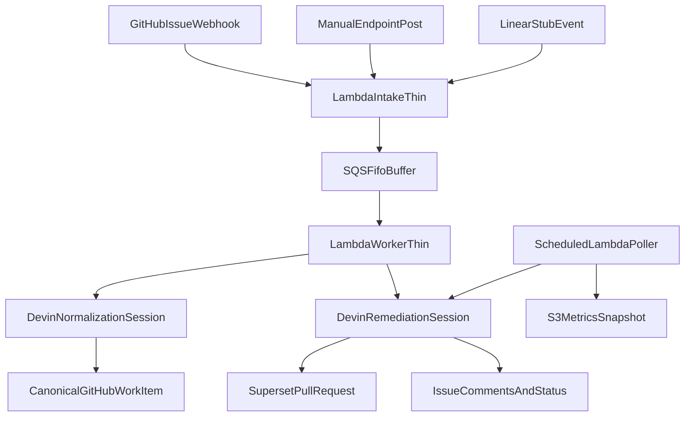

# Devin-Driven Event Remediation on AWS

## TL;DR

This project is an AWS-hosted event-driven remediation pipeline that treats Devin as the core primitive in two separate stages:

1. A thin AWS intake layer receives events and buffers them in SQS FIFO.
2. The AWS worker asks Devin to normalize the event into a scoped work item, and then asks Devin again to remediate it if automation is safe.

Supported event sources:

- GitHub issue events, with vulnerability-related issues as the P0 source
- Manual endpoint hits
- Linear ticket events, currently stubbed but fully represented in the architecture

AWS is the primary runtime:

- Lambda Function URL for intake
- SQS FIFO for buffered ordering
- Lambda worker for remediation
- Lambda poller for observability
- Secrets Manager for credentials
- S3 for lightweight report snapshots

This deliberately does not try to be a new scanner. Existing tools like Dependabot, `npm audit`, `pip-audit`, and Trivy can produce findings. This system handles the harder part: turning raw events into scoped engineering work and driving Devin through the full remediation loop.

## Repositories

- Target application repo: `C0smicCrush/superset-remediation`
- Automation repo: `C0smicCrush/devin-vuln-automation`

`superset-remediation` is where the tracked GitHub issues and remediation PRs live.

`devin-vuln-automation` contains the AWS runtime, Lambda handlers, SQS integration, deployment script, testing tier matrix, unit tests, and local simulation tooling.

## Architecture



## Event Sources

### GitHub issues

This is the P0 path for the vulnerability-focused version of the project.

- GitHub sends an issue webhook to the Lambda Function URL.
- The intake Lambda only verifies/parses the webhook and enqueues the raw event.
- The worker asks Devin to decide whether the item is actually security relevant before remediation.

### Manual endpoint

This is the operator/debug path.

- A caller hits the same Function URL with a JSON payload.
- The intake Lambda wraps it and enqueues it without trying to reason about the task.

### Linear tickets

This is currently stubbed, but supported in the design.

- A Linear payload can hit the same intake Lambda.
- The system treats it the same way as any other source: enqueue -> normalize with Devin -> remediate with Devin.

## Why Devin Is Used Twice

This design intentionally uses Devin in two roles.

### 1. Normalization primitive

The worker asks Devin to act as a scoped analysis engine:

- reads the raw source event
- turns it into a clean problem statement
- decides whether it is security related
- assigns a scope tier
- proposes a test plan
- decides whether full automation is safe or manual approval is required

This gives the pipeline a richer work item than a raw GitHub webhook or audit finding, while keeping Lambda itself intentionally dumb.

### 2. Remediation primitive

After the buffered queue delay, Devin handles the actual fix:

- makes the code change in `superset-remediation`
- runs the scoped validation plan
- reports blockers or approval needs
- opens a PR when the fix is safe to land

## Queueing Model

The queue is intentionally not just a fire-and-forget pipe.

- AWS service: SQS FIFO
- Default delay: 30 seconds in the current test deployment, configurable back to 5 minutes for production
- Ordering scope: per-family ordering key, never global ordering
- Worker batch size: 1
- Worker logic is intentionally thin and primarily orchestrates Devin calls

### Why the buffered hold exists

The delay gives the pipeline a chance to preserve local ordering for related work items, especially when multiple dependency-related or semantically related events arrive close together.

We never try to globally reorder the entire queue. We only preserve ordering inside a message group, such as a shared dependency family or issue family key. Within that family, the first created event goes first.

### Queue backpressure trade-off

This introduces intentional latency and can create queue backpressure during bursts. That is a conscious trade-off:

- better local ordering for related events
- lower chance of racing two overlapping remediations
- easier reasoning about dependency-related work

The downside is slower time-to-remediation during spikes. The README calls this out explicitly because it is a deliberate architecture choice, not an accident.

## Scope Normalization and Testing Tiers

The normalization step outputs a full scope card, not just a summary.

The work item includes:

- normalized problem statement
- family key for ordering
- scope tier
- automation decision
- confidence level
- likely touched files
- impacted surface
- suggested validation commands
- whether new tests are likely needed
- manual checks if approval is required

The current tier matrix lives in `config/test_tiers.json`.

### Tier intent

- `tier0_auto_dependency_patch`
  - small direct dependency bump
  - existing validation likely sufficient
- `tier1_auto_targeted_runtime`
  - runtime-facing but still bounded
  - requires more focused validation and often targeted regression coverage
- `tier2_manual_review`
  - broader impact or lower confidence
  - human approval expected before full automation
- `tier3_manual_hold`
  - stop after scoping
  - do not auto-remediate

This is the foundation for the skeletonized testing framework: the test plan is generated per work item by Devin, but mapped into stable automation tiers so the system stays interpretable.

## Live Deployment Notes

The current deployed stack is running in `us-east-1` and is configured for fast iteration:

- SQS FIFO delay is `30s`
- the intake Lambda Function URL is live
- the `superset-remediation` repo has an `issues` webhook pointed at the `/github` intake path

For a production-style delay, redeploy with:

```bash
QUEUE_DELAY_SECONDS=300 bash infra/deploy_aws.sh
```

## Cost Controls

This is designed for a personal AWS account and intentionally avoids expensive services.

- Lambda Function URL is used instead of API Gateway to keep the ingress path cheap.
- Lambda memory is kept small:
  - intake: 512 MB
  - worker: 256 MB
  - poller: 256 MB
- Worker SQS mapping concurrency is capped at 2, while in-app remediation concurrency is separately limited.
- SQS batch size is 1 to avoid bursty fan-out.
- Secrets are consolidated into a single Secrets Manager JSON secret to reduce monthly secret count.
- S3 is used for lightweight report snapshots instead of a heavier database/dashboard stack.

## Rate Limiting

There are two layers of rate limiting:

1. SQS event source mapping concurrency on the worker
2. `MAX_ACTIVE_REMEDIATIONS` guard inside the worker

In practice, because this AWS account has a low concurrency floor, the deployment uses an SQS event source maximum concurrency of 2 and then applies the tighter application-level remediation cap with `MAX_ACTIVE_REMEDIATIONS`.

If the active remediation count is already at the configured maximum, the worker re-enqueues the message with a short delay instead of launching another remediation session immediately.

## Thin Lambda Principle

Lambda is deliberately not the brains of the system.

The AWS functions only do glue work:

- verify and parse source events
- enqueue raw payloads
- call Devin for normalization
- call Devin for remediation
- mirror status to GitHub and S3

They do not try to implement their own scoping engine, custom prioritization engine, or remediation planner. That logic belongs in Devin so the architecture clearly demonstrates Devin as the primitive rather than Lambda as a hidden rules engine.

## Secrets and Configuration

AWS is the primary secret store.

One Secrets Manager secret stores:

- `GH_TOKEN`
- `DEVIN_API_KEY`
- `DEVIN_ORG_ID`
- `GITHUB_WEBHOOK_SECRET`
- `LINEAR_WEBHOOK_SECRET`
- `TARGET_REPO_OWNER`
- `TARGET_REPO_NAME`
- `AWS_METRICS_BUCKET`
- `MAX_ACTIVE_REMEDIATIONS`
- `DEVIN_BYPASS_APPROVAL`

Lambdas receive only lightweight environment variables:

- `AWS_APP_SECRET_NAME`
- `AWS_SQS_QUEUE_URL`
- `AWS_METRICS_BUCKET`
- `MAX_ACTIVE_REMEDIATIONS`
- `TARGET_REPO_OWNER`
- `TARGET_REPO_NAME`

## Repository Layout

```text
.
├── aws_runtime.py
├── lambda_intake.py
├── lambda_worker.py
├── lambda_poller.py
├── common.py
├── config/
│   └── test_tiers.json
├── infra/
│   └── deploy_aws.sh
├── scripts/
│   ├── common.py
│   ├── create_issues.py
│   ├── launch_devin_session.py
│   ├── poll_devin_sessions.py
│   ├── render_metrics.py
│   └── scan_or_import_findings.py
├── fixtures/
├── state/
├── metrics/
├── requirements.txt
├── Dockerfile
└── Makefile
```

## Deployment

The project can be deployed entirely with the AWS CLI:

```bash
make deploy-aws
```

This script:

- creates the SQS FIFO queue and DLQ
- creates the S3 metrics bucket
- creates or reuses the shared Secrets Manager secret
- creates the Lambda IAM role and permissions
- packages the Lambda code
- deploys the intake, worker, and poller Lambdas
- creates the Lambda Function URL
- creates or updates the GitHub issue webhook on `superset-remediation`
- wires SQS to the worker
- schedules the poller every 5 minutes

After deployment, the intake Function URL supports:

- `/github`
- `/linear`
- `/manual`

## Local Development

For local scripts and simulation:

```bash
export GH_TOKEN="$(gh auth token)"
export DEVIN_API_KEY="cog_your_service_user_key"
export DEVIN_ORG_ID="org_your_org_id"
export TARGET_REPO_OWNER="C0smicCrush"
export TARGET_REPO_NAME="superset-remediation"
```

Legacy local flows still exist for deterministic replay:

```bash
make discover
make issues
make launch ISSUE_NUMBER=1
make poll
make report
```

Docker remains available for local packaging and repeatable runtime setup:

```bash
docker compose build
```

Run the unit tests:

```bash
make test
```

Replay sample events against the deployed intake URL:

```bash
export INTAKE_URL="https://ymydxnbhsmlifqxnw55oahd4r40aazsr.lambda-url.us-east-1.on.aws"
make invoke-manual
make invoke-linear
```

## Observability

The observability story is intentionally simple but leadership-friendly.

Outputs include:

- GitHub issue comments in `superset-remediation`
- Devin session URLs and PR links
- S3 snapshot `reports/latest.json`
- CloudWatch logs from intake, worker, and poller

The key metrics are:

- total normalized work items
- active remediation sessions
- completed sessions
- blocked/manual-review sessions
- failed sessions
- PRs opened by Devin

## CI/CD

The current repo includes a CLI-driven deploy path rather than a heavier managed CI/CD stack because the goal is to stay cost-conscious on a personal AWS account.

The natural next step is to wire `infra/deploy_aws.sh` into CodeBuild or CodePipeline. That would keep the same deployment contract while moving packaging and promotion into AWS-native CI/CD.

## Trade-Offs

- Findings and non-GitHub sources can be stubbed for deterministic demos, but the intake path is designed around real webhook traffic.
- The FIFO delay improves local ordering but increases queue latency and potential backpressure.
- Devin-based normalization is more expensive than a pure rule engine, but it produces richer scope and testing decisions for ambiguous engineering work.
- The worker is intentionally rate-limited to protect both AWS cost and the target repository from too much concurrent automation.
