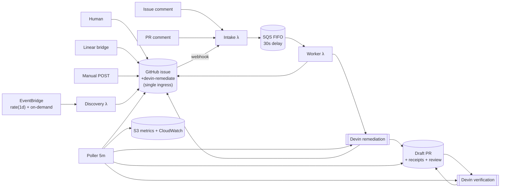

# Event-Driven Devin Remediation on AWS

## TL;DR

This project is an AWS-hosted event-driven remediation control plane for a fork of Apache Superset.

The key design choice is simple:

`AWS governs the workflow. Devin performs the engineering work.`

In practice that means:

1. An engineering event is created by a human, a deterministic tool, or a scheduled discovery run.
2. AWS intake receives the event, validates it, wraps it in a canonical envelope, and buffers it in SQS FIFO.
3. The worker launches Devin as the end-to-end remediation operator for that work item.
4. Devin investigates the issue, scopes the blast radius, chooses validation, makes the fix if appropriate, and opens or updates a PR.
5. A poller tracks status and publishes observable outputs to GitHub, S3, and CloudWatch.

The system is intentionally multi-source. Events can come from:

- GitHub issues explicitly labeled `devin-remediate`
- Linear tickets
- manual API requests
- scheduled scanner findings such as `npm audit`
- scheduled Devin discovery runs

This project does not try to replace scanners. Existing tools produce findings; this system turns those findings into governed remediation work and uses Devin to execute the engineering loop.

## Repositories

- Target application repo: `C0smicCrush/superset-remediation`
- Automation repo: `C0smicCrush/devin-vuln-automation`

`superset-remediation` is the work surface where issues and remediation PRs live.

`devin-vuln-automation` is the control plane. It contains the Lambda handlers, SQS integration, deployment scripts, prompt helpers, scope/test policy, and simulation tooling.

## What This System Does

This project solves a specific workflow problem:

`when a remediation-worthy engineering signal appears, route it through a low-cost event system and let Devin handle the actual engineering task with observable outcomes`

The signal can be a vulnerability finding, a ticket, or a tracked issue. The system does not assume all work starts as a GitHub issue, but it does use GitHub as the most important human-visible artifact surface.

## Why Devin Is The Primitive

The take-home prompt explicitly asks for Devin to be used as a core primitive, not as a helper.

So the system is designed such that AWS does not become the reasoning engine.

AWS is responsible for:

- receiving and validating events
- canonicalizing payloads
- queueing and ordering work
- enforcing rate limits and safety controls
- launching Devin sessions
- polling session state
- publishing metrics and status

Devin is responsible for:

- interpreting the incoming issue or finding
- inspecting repository context
- deciding whether the work item is actionable
- identifying the smallest safe remediation
- choosing the right validation scope
- making code changes
- running validation
- opening or updating a PR
- summarizing blockers, residual risk, or manual-review needs

That split keeps the control plane thin and makes Devin the owner of the engineering loop.

## Event Sources

There is exactly one ingress to the remediation pipeline: a **GitHub issue labeled `devin-remediate`**. Everything listed below is a **producer** of that event, not a separate pipeline. Humans, Linear bridges, manual POSTs, scheduled scanners, and scheduled Devin discovery runs all converge on the same ingress and flow through a single path: webhook → intake → SQS → worker → Devin remediation → PR.

This gives the system one ingress to harden, one dedup boundary (issue number + `finding:<id>`), one append-only event log per work item (the issue and its comments), and a pluggable producer surface — new sources slot in as additional arrows into the ingress without changing anything downstream.

Once a tracked issue or PR exists, **new human comments on that issue or PR** also become first-class follow-up events. Those comments do not create a second pipeline; they re-enter the same control plane as ambiguous follow-up work items, and the next Devin remediation session itself decides whether they should:

- get ignored as non-actionable chatter
- pause for manual review
- launch a bounded remediation follow-up tied to the same issue family

### 1. GitHub issue events

Examples:

- issue opened with `devin-remediate`
- issue reopened with `devin-remediate`
- issue labeled `devin-remediate`

This is the cleanest P0 source because it aligns directly with the assignment and gives reviewers visible work items inside the fork.

Important detail:

- the deployed intake only accepts `issues` webhook events that explicitly carry `devin-remediate`

### 2. Linear ticket events

Examples:

- ticket created in a remediation queue
- ticket moved to `ready-for-remediation`
- ticket labeled security or dependency-related

This path proves the system is not GitHub-specific.

### 3. Manual API events

Examples:

- manual POST to `/manual`
- replay of a fixture for demos
- operator-triggered remediation run

This path exists for deterministic demos and easy replay.

### 4. Scheduled scanner events

Examples:

- EventBridge schedule triggers a lightweight scan
- `npm audit --json` or similar produces findings
- findings are emitted into the standard intake path

This is the strongest deterministic vulnerability source because it keeps detection simple and lets Devin focus on investigation, remediation, and validation.

### 5. Scheduled Devin discovery events

Examples:

- daily repo review
- bounded dependency review
- targeted review of recently changed code paths

This is how Devin can "find issues itself." A scheduler or operator triggers a discovery run, Devin emits structured findings, and those findings become issues or remediation events.

The hosted stack includes an EventBridge-driven discovery schedule. EventBridge here is used strictly as a **dumb cron** — it wakes the discovery producer on a timer and is not otherwise involved in the pipeline:

- EventBridge rule: `rate(1 day)` (also manually invokable via `aws lambda invoke`)
- target: `devin-vuln-automation-discovery`
- default input: `{"event_type":"scheduled_discovery","max_findings":1}`

Discovery's only output is a GitHub issue with `devin-remediate` and `finding:<id>`. From that point forward it flows through the same path as any other issue. Discovery does not have its own remediation lane.

### Bounded discovery driver

There is also a bounded discovery driver for low-volume end-to-end runs:

```bash
make discover-devin
```

By default it is intentionally conservative:

- launches at most one discovery session at a time
- asks Devin for at most one actionable finding by default
- only creates issues for medium/high-confidence findings
- dedupes against existing open issues before creating a new one
- creates labeled GitHub issues that then enter the normal AWS webhook -> SQS -> worker path

## Architecture



Read it left-to-right: **root producers create tracked issues, then comments on those tracked issues/PRs create follow-up events through the same control plane.** Discovery is just another producer whose job happens to be "use a bounded Devin session to decide what issues to file." The pipeline does not know or care who filed any given issue, and it treats human follow-up comments as serialized continuation events rather than a separate workflow.

## End-To-End Flow

1. An event is created by a human, tool, scheduler, or Devin discovery run.
2. Intake Lambda receives the event and wraps it in a canonical event envelope.
3. The event is written to SQS FIFO using a family-specific ordering key.
4. Worker Lambda consumes the message once it is eligible.
5. The worker applies guardrails such as concurrency limits and manual-review policy.
6. The worker launches one broad Devin session for the work item.
7. Devin investigates the issue, chooses the remediation strategy, validates its work, and opens or updates a PR if appropriate.
8. A second Devin verification session reviews the PR, independently checks whether it actually fixes the issue, and writes its verdict to the PR and linked issue.
9. Poller Lambda tracks the remediation / verification sessions and writes deduped status back to GitHub and S3.

All tracked work items now use the same core path. The worker shapes a lightweight canonical work item, launches one broad Devin remediation session, and that single session decides whether to ignore the input, stop for manual review, ask a human question, or continue into implementation.

### Scheduled Devin discovery (a producer, not a separate pipeline)

Discovery is an issue producer. Its output is a GitHub issue; from there it uses the exact same flow above:

1. EventBridge (daily cron, also manually invokable) triggers `devin-vuln-automation-discovery`.
2. Discovery Lambda acquires an S3 lease and checks for any already-active discovery session.
3. Discovery Lambda launches one bounded Devin discovery session (`max_acu_limit: 1`).
4. For each high-confidence, deduped finding, Discovery Lambda creates a GitHub issue labeled `devin-remediate` + `finding:<id>`.
5. That issue fires the webhook and re-enters the main flow at step 1 above — no special casing.

This is deliberate. Any future issue producer (Trivy webhook, pip-audit cron, Sentry bridge) slots in the same way: it files an issue and the pipeline consumes it identically.

## Canonical Event Model

All event sources are wrapped into a common envelope before they hit the worker.

Representative fields include:

- `event_type`
- `event_phase`
- `source.type`
- `source.action`
- `source.id`
- `source.url`
- `repo.owner`
- `repo.name`
- `title`
- `body`
- `labels`
- `created_at`
- `family_key`
- `canonical_issue_number`
- `origin_metadata`

The envelope is meant to standardize transport, not to replace Devin's reasoning.

## Queueing Model

The queue is intentionally not just a pass-through.

- AWS service: SQS FIFO
- Buffer queue: `devin-vuln-automation-buffer.fifo`
- DLQ: `devin-vuln-automation-dlq.fifo`
- Default live test delay: `30s`
- Production-style delay: `300s`
- Ordering scope: per `family_key`, not global
- Worker batch size: `1`

### Why the buffered hold exists

The delay creates a small stickiness window so related events can remain locally ordered. This matters most for dependency families, repeated issue updates, or semantically related findings.

### Queue backpressure trade-off

The FIFO delay improves local ordering and reduces overlapping remediation attempts, but it also increases latency and can create backlog during bursts. That trade-off is intentional.

## Testing and Scope Policy

The system keeps explicit scope and validation policy so the automation remains interpretable.

Policy lives in:

- `config/test_tiers.json`

Current tiers:

- `tier0_auto_dependency_patch`
- `tier1_auto_targeted_runtime`
- `tier2_manual_review`
- `tier3_manual_hold`

These tiers should be thought of as policy guidance for Devin, not as a hardcoded workflow engine inside Lambda.

That means the worker can tell Devin:

- what automation levels are allowed
- when manual review is required
- how broad the expected validation should be

But Devin should still decide the actual engineering plan.

### Validation receipts contract

For the vulnerability flow specifically, Devin is required to attach structured receipts to every remediation PR. The remediation prompt and structured output schema both enforce this:

- `scanner_before`: exact command, exit code, and advisory IDs produced by the relevant scanner (`npm audit --json`, `pip-audit`, or equivalent) before any code change.
- `scanner_after`: the same command, rerun after the fix, so reviewers can see the advisory disappear.
- `tests`: each scoped test command with its exit code, a pass/fail flag, and a short summary.
- `fixed_advisories` / `deferred_advisories`: advisories this PR actually resolves versus ones deliberately left for follow-up issues.
- `residual_risk`: a plain-language note about anything that was not validated and why.

If a required command cannot run in Devin's sandbox, it must be recorded with `ran: false` and a `not_run_reason`. Silent skips are treated as a failure mode rather than a success.

### One advisory per PR

Both the discovery and remediation prompts push toward one advisory or CVE per tracked issue and per PR. If a finding aggregates several advisories that do not share a single package bump, Devin is instructed to remediate only the tightest subset in this PR and to note the remaining advisories as deferred so they can be picked up as their own issues. This keeps review surface bounded and keeps the scanner receipts meaningful.

### Rejected findings audit trail

The discovery prompt and schema require Devin to record candidates it considered and discarded in `rejected_findings`, with a short reason (false positive, unused code path, upstream-only, already fixed, too-large bump, etc.). The discovery Lambda and local runner return that list alongside the accepted findings, so reviewers can see both what became an issue and what was deliberately not pursued.

## Thin Lambda Principle

Lambda is deliberately not the brains of the system.

The AWS functions only do glue work:

- verify and parse source events
- enqueue canonical payloads
- enforce concurrency and queue behavior
- launch Devin
- mirror status to GitHub and S3

They do not try to become a scoping engine, prioritization engine, or remediation planner.

## Current Validation State

The system has already exercised meaningful pieces of the end-to-end path.

Validated behavior includes:

- manual intake event handling
- queue buffering
- worker-driven Devin launch
- status propagation back to GitHub
- real remediation activity tied to a DOMPurify-related finding path

The strongest live validation during development was a remediation PR flow against `superset-remediation`, even though later cleanup changed the final visible repository state.

## Live Deployment Notes

The current deployed stack is in `us-east-1` and was configured for fast testing iteration:

- SQS FIFO delay is `30s`
- intake is exposed through a Lambda Function URL
- issue-based webhook flow was exercised against `superset-remediation`

To redeploy with a production-style delay:

```bash
QUEUE_DELAY_SECONDS=300 bash infra/deploy_aws.sh
```

## Cost Controls

This is designed for a personal AWS account and intentionally avoids expensive services.

- Lambda Function URL instead of API Gateway
- small Lambda memory sizes
- SQS instead of a custom orchestration backend
- single shared Secrets Manager JSON secret
- S3 for lightweight snapshots instead of a heavier database layer
- capped worker concurrency
- application-level remediation cap in addition to AWS concurrency controls

## Rate Limiting

There are two layers of rate limiting:

1. SQS event source concurrency on the worker
2. `MAX_ACTIVE_REMEDIATIONS` inside the worker

If the active remediation count is already at the configured maximum, the worker defers or re-enqueues the item instead of launching another Devin session immediately.

Additional anti-spam controls:

- GitHub issue webhook intake only accepts `issues` events that are explicitly labeled `devin-remediate`
- repeated issue events for the same issue number are deduped against active remediation sessions
- discovery is capped to a very small number of findings per run
- scheduled discovery uses an S3-backed lease plus an active-session check so overlapping discovery runs are skipped rather than duplicated

## Secrets and Configuration

AWS is the primary secret store.

The shared Secrets Manager secret holds values such as:

- `GH_TOKEN`
- `DEVIN_API_KEY`
- `DEVIN_ORG_ID`
- `GITHUB_WEBHOOK_SECRET`
- `LINEAR_WEBHOOK_SECRET`
- `TARGET_REPO_OWNER`
- `TARGET_REPO_NAME`
- `AWS_METRICS_BUCKET`
- `MAX_ACTIVE_REMEDIATIONS`
- `MAX_DISCOVERY_FINDINGS`
- `DISCOVERY_TIMEOUT_SECONDS`
- `DISCOVERY_LOCK_TTL_SECONDS`
- `DEVIN_BYPASS_APPROVAL`

Notes:

- `LINEAR_WEBHOOK_SECRET` may be stored for future production hardening, but the current `/linear` path is still a stub and does not yet enforce signature verification.
- Lambdas only receive lightweight environment variables where possible.

## Repository Layout

```text
.
├── aws_runtime.py
├── lambda_intake.py
├── lambda_worker.py
├── lambda_poller.py
├── lambda_discovery.py
├── common.py
├── config/
│   └── test_tiers.json
├── infra/
│   └── deploy_aws.sh
├── scripts/
│   ├── common.py
│   └── run_devin_discovery.py
├── fixtures/
│   ├── linear.sample.json
│   └── manual.sample.json
├── state/
├── metrics/
├── requirements.txt
├── Dockerfile
└── Makefile
```

## Deployment

Deploy with the AWS CLI:

```bash
make deploy-aws
```

The deployment script:

- creates the FIFO queue and DLQ
- creates the S3 metrics bucket
- creates or reuses the shared Secrets Manager secret
- creates IAM role and permissions
- packages and deploys intake, worker, poller, and discovery Lambdas
- creates the Lambda Function URL
- wires SQS to the worker
- schedules the poller
- schedules EventBridge discovery daily (`rate(1 day)`; also manually invokable)
- can wire GitHub issue webhooks for the target repo

Supported intake paths:

- `/github`
- `/linear`
- `/manual`

### Continuous deployment

`.github/workflows/deploy.yml` runs on every push to `main` (and on manual `workflow_dispatch`). It runs the unit test suite and, only if tests pass, executes `infra/deploy_aws.sh` against the configured AWS account. The script is idempotent, so repeated pushes reconverge the stack rather than recreating it.

Required repo secrets:

- `AWS_ACCESS_KEY_ID` and `AWS_SECRET_ACCESS_KEY` (credentials for the deploy target account)
- `DEVIN_API_KEY` and `DEVIN_ORG_ID` (only consumed on first deploy to seed Secrets Manager)
- `GH_TOKEN` (optional; falls back to `GITHUB_TOKEN`. Needed with `admin:repo_hook` scope only if the GitHub webhook on `superset-remediation` has to be (re)created; otherwise the script skips that step.)

Optional repo variable:

- `AWS_REGION` (defaults to `us-east-1`)

## Local Development

Export local credentials:

```bash
export GH_TOKEN="$(gh auth token)"
export DEVIN_API_KEY="cog_your_service_user_key"
export DEVIN_ORG_ID="org_your_org_id"
export TARGET_REPO_OWNER="C0smicCrush"
export TARGET_REPO_NAME="superset-remediation"
```

Build the local container environment:

```bash
docker compose build
```

The default `docker compose` command runs the unit test suite inside the container. It is not a full local Lambda stack.

Run unit tests:

```bash
make test
```

Replay sample events against the deployed intake URL:

```bash
export INTAKE_URL="<lambda-url>"
make invoke-manual
make invoke-linear
```

## Observability

The observability layer is intentionally simple but sufficient for a technical audience.

Outputs include:

- GitHub issue comments
- Devin session links and PR links
- S3 snapshot `reports/latest.json`
- CloudWatch logs from intake, worker, and poller

In local or GitHub Actions helper flows, metrics may also be written to `metrics/latest.json`; that is separate from the hosted S3 snapshot path.

Key metrics include:

- queued work items
- active Devin sessions
- completed sessions
- blocked or manual-review sessions
- failed sessions
- PRs opened by Devin
- tracked items verified
- tracked items verified in first pass
- tracked items that required human follow-up
- tracked items with multiple remediation loops
- total accepted human comment follow-ups
- verification verdict counts (`verified`, `partially_fixed`, `not_fixed`, `not_verified`)

## Trade-Offs

- Scanner findings are more deterministic than pure Devin discovery, so both should exist.
- FIFO buffering improves local ordering but increases time-to-remediation during bursts.
- Keeping the control plane thin means the worker only canonicalizes transport-level input. Devin owns the triage decision inside the single remediation session.
- Tight concurrency limits protect both AWS cost and the target repo, but reduce throughput.
- GitHub is the best audit surface for reviewers, even when the original signal came from somewhere else.

## More Detail

For the deeper design document, including event taxonomy, source-by-source workflows, current-vs-target architecture, and explicit AWS versus Devin ownership, see `ARCHITECTURE.md`.
