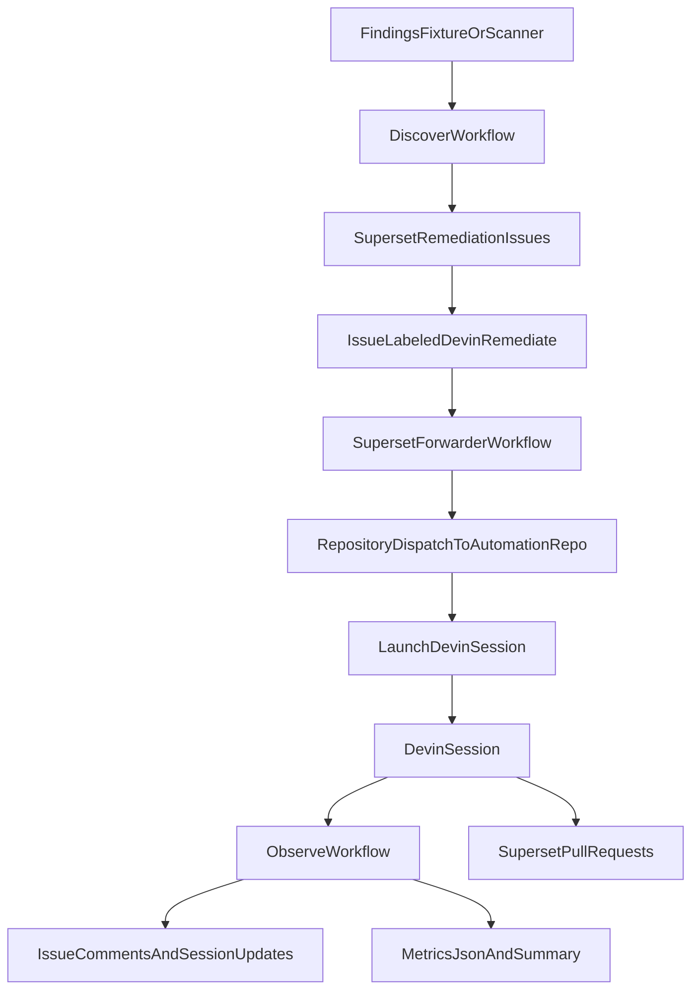

# Devin-Driven Vulnerability Remediation

This repository is the control plane for an event-driven vulnerability remediation demo built around the Devin API. It watches for remediation issues in a private Superset repository, launches Devin sessions to fix them, and reports progress back to engineering stakeholders through GitHub issues, workflow summaries, and lightweight metrics artifacts.

## Repositories

- Target application repo: `C0smicCrush/superset-remediation`
- Automation repo: `C0smicCrush/devin-vuln-automation`

The target repo stays private and receives the remediation issues and Devin pull requests. This repo stays private and owns the orchestration logic, Docker image, workflows, and observability outputs.

## What It Does

1. Normalizes security findings from a fixture or scanner output.
2. Creates remediation issues in the private Superset repo.
3. Triggers Devin when an issue is labeled `devin-remediate`.
4. Polls Devin session status through the v3 API.
5. Publishes status updates back to the GitHub issue and emits metrics for leaders.

## Why Devin Is The Core Primitive

This system does not remediate dependencies itself. The automation only decides what work should happen, launches Devin sessions through the API, and observes the result. Devin owns the actual code change, validation, and pull request creation.

## Architecture



## Repository Layout

```text
.
├── .github/workflows/
│   ├── discover.yml
│   ├── observe.yml
│   └── remediate.yml
├── fixtures/findings.sample.json
├── metrics/
├── scripts/
│   ├── common.py
│   ├── create_issues.py
│   ├── launch_devin_session.py
│   ├── poll_devin_sessions.py
│   ├── render_metrics.py
│   └── scan_or_import_findings.py
├── state/
├── Dockerfile
├── docker-compose.yml
└── Makefile
```

## Required Secrets

In `C0smicCrush/devin-vuln-automation`:

- `DEVIN_API_KEY`: service-user key for the Devin org API
- `DEVIN_ORG_ID`: org identifier for the Devin API
- `GH_TOKEN`: GitHub token with access to both private repos

In `C0smicCrush/superset-remediation`:

- `AUTOMATION_REPO_DISPATCH_TOKEN`: GitHub token that can call `repository_dispatch` on `C0smicCrush/devin-vuln-automation`

## GitHub Workflows

### `discover.yml`

- Runs on schedule or manual dispatch
- Loads `fixtures/findings.sample.json`
- Creates remediation issues in the Superset repo

### `remediate.yml`

- Runs on manual dispatch or `repository_dispatch`
- Launches a Devin session for the specified Superset issue
- Posts the session URL back to the issue

### `observe.yml`

- Runs on schedule or manual dispatch
- Polls Devin for tagged sessions
- Writes `metrics/latest.json`
- Writes `metrics/summary.md`
- Appends an executive summary to the GitHub Actions run

### Superset Forwarder Workflow

The target repo contains `.github/workflows/forward-devin-remediation.yml`. When a Superset remediation issue is labeled `devin-remediate`, it forwards the event into this repo via `repository_dispatch`.

## Local Simulation

Set the required environment variables first:

```bash
export GH_TOKEN="$(gh auth token)"
export DEVIN_API_KEY="cog_your_service_user_key"
export DEVIN_ORG_ID="org_your_org_id"
export TARGET_REPO_OWNER="C0smicCrush"
export TARGET_REPO_NAME="superset-remediation"
```

Run the discovery flow locally:

```bash
make discover
make issues
```

Launch Devin for a specific issue:

```bash
make launch ISSUE_NUMBER=1
```

Poll and render the report:

```bash
make poll
make report
```

You can also use Docker:

```bash
docker compose run --rm controller python scripts/scan_or_import_findings.py
docker compose run --rm controller python scripts/create_issues.py
```

## Observability Outputs

The system surfaces progress in three places:

- GitHub issue comments in `superset-remediation`
- GitHub Actions run summaries in `devin-vuln-automation`
- `metrics/latest.json` and `metrics/summary.md` artifacts

The key signals are:

- findings processed
- issues created
- sessions launched
- active, completed, blocked, and failed session counts
- number of pull requests opened by Devin

## Demo Script

1. Run `Discover Vulnerabilities` or show the already-created remediation issues.
2. Label one issue `devin-remediate` in `superset-remediation`.
3. Show the forwarding workflow dispatching into `devin-vuln-automation`.
4. Show `Launch Devin Remediation` creating a Devin session and commenting on the issue.
5. Show `Observe Devin Sessions` producing metrics and surfacing the PR URL once Devin opens it.

## Trade-Offs

- Findings are fixture-backed for deterministic demos, though the `discover` stage can be swapped with real scanner output later.
- Observability intentionally uses GitHub-native outputs and JSON artifacts instead of a dedicated database to keep the take-home scoped.
- The system is optimized for a technical demo, not for high-scale production throughput.
